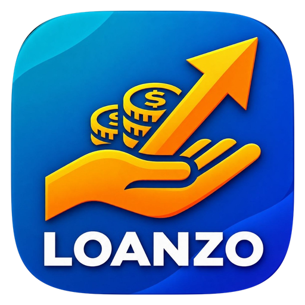
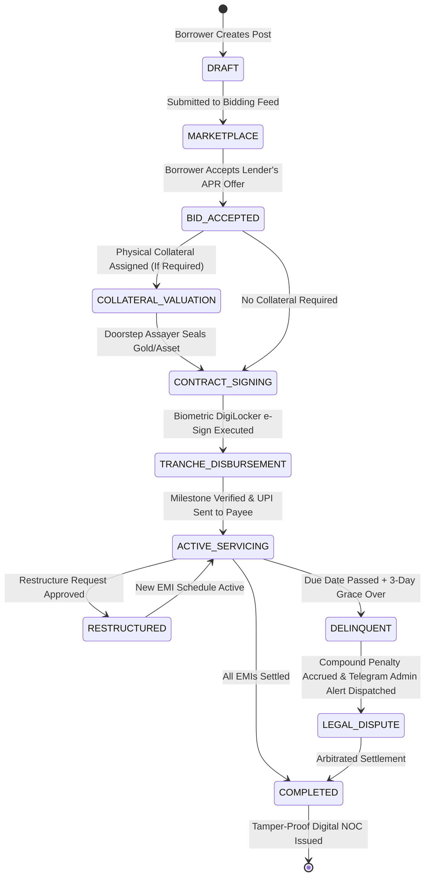
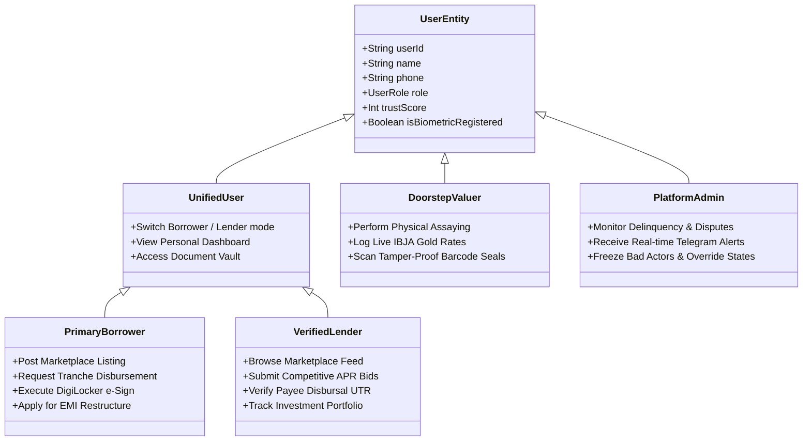

<div align="center">



# 💎 LOANZO
### **Next-Generation Decentralized Peer-to-Peer (P2P) Microfinance & Social Lending Protocol**

*Empowering transparent, purpose-bound lending with mathematical rigor, zero-scam architecture, and institutional compliance.*

---

[](https://kotlinlang.org)
[](https://developer.android.com)
[](https://developer.android.com/jetpack/compose)
[](https://developer.android.com/training/data-storage/room)
[](https://dagger.dev/hilt/)
[](https://firebase.google.com)
[](LICENSE)

[🌟 Highlights](#-key-innovations--core-features) •
[🛡️ Scam-Free Guarantee](#️-institutional-scam-free-guarantee) •
[🏗️ Architecture](#️-system-architecture) •
[🔄 Lifecycle](#-loan-lifecycle-state-machine) •
[🗄️ Database](#️-database-architecture-room-v11) •
[📚 Docs & Comics](#-publications--engineering-reports) •
[⚡ Quickstart](#-quickstart--developer-setup)

</div>

---

## 📖 Executive Summary

**Loanzo** is an enterprise-grade Android microfinance platform engineered to bridge the gap between credit-worthy borrowers and private retail lenders. By combining **direct peer-to-peer social bidding (Lenme style)**, **purpose-bound merchant disbursements**, **physical collateral assaying**, **DigiLocker biometric e-Sign**, and an **automated Telegram & FCM alert desk**, Loanzo completely eliminates fraudulent loan scams, predatory interest traps, and unmonitored fund diversion.

Built purely in **Modern Android (Jetpack Compose, Clean Architecture, Room v11, Kotlin Coroutines & Flow)**, Loanzo provides offline-first resiliency, military-grade client-side encryption, and seamless cloud synchronization with both Google Drive and Firebase.

---

## 🌟 Key Innovations & Core Features

### 1. 🎯 Purpose-Linked Tranche Disbursements
- Rather than releasing lump-sum cash directly into borrower accounts where funds can be misappropriated, disbursements are released in verified milestones (*Tuition, Hospital Invoices, Raw Materials*).
- **Direct Payee Settlement**: Capital is dispatched straight to verified vendor / institution UPI accounts with mandatory invoice verification.

### 2. ⚡ Lenme-Style Social Bidding Marketplace
- Borrowers post loan requests specifying purpose, target amount, duration, and maximum APR.
- Verified retail lenders compete to fund the loan by placing competitive APR and tenure bids.
- Borrowers review lender ratings, trust scores, and bid terms before accepting the optimal offer.

### 3. ⚖️ Mathematical Compound Penalty Engine
- Fully automated, deterministic penalty calculation with zero human discretion.
- **Grace Period**: 3-day grace period with zero compounding fees.
- **Penalty Formula**: Transparent daily compound fee capped at 50% of the overdue installment to prevent predatory debt cycles.

### 4. 🧭 Interactive Onboarding & Step-by-Step Guided Tours
- **Welcome Onboarding Carousel**: 4-slide interactive overview with progress pill indicators and smooth swiping.
- **Contextual First-Visit Guides**: Floating glass tooltip cards on Dashboard, Loans, Marketplace, and Profile.
- **Blinking Navigation Beacons**: Ambient gold glow pulse highlighting unvisited tabs with contextual tooltips.
- **5 Guided Interactive Tours**: Step-by-step walkthroughs (`How to Request a Loan`, `Setting Up Your Profile`, `Using the Marketplace`, `Track Your Loans`, `Document Vault and Security`).

### 5. 🔐 Zero-Flicker Session Gate & Fluid Transitions
- **Session Gate**: Eliminates cold-start login flash by evaluating session state inside an ambient breathing-pulse Splash Screen.
- **Shared-Axis Horizontal Slide Transitions**: 320ms 25% parallax animations across outer and sub-page navigations.
- **Predictive Back Navigation**: Native gesture animations enabled via `android:enableOnBackInvokedCallback`.

### 6. 🛡️ Encrypted Document Vault & Biometric Access
- Client-side AES-256-GCM encrypted storage for Aadhaar, PAN, and title deeds.
- Protected by biometric authentication (fingerprint / face unlock) and PIN gateway.
- Automated daily backup and synchronization to Google Drive via Google Drive REST API v3.

### 7. 🤖 Automated Telegram Admin & 24/7 Assistant Bot
- Integrated Telegram Assistant Bot (`@Loanzo_bot`) for instantaneous loan status lookups and counterparty notifications.
- Emergency Dispute & Delinquency Dispatch center sending immediate real-time enforcement alerts to the admin desk.

---

## 🛡️ Institutional Scam-Free Guarantee

Traditional lending and predatory instant-loan apps suffer from fake lenders, upfront processing fee extortions, and abusive harassment. Loanzo's cryptographic architecture eliminates these vulnerabilities:

| Vulnerability Vector | Predatory Loan Apps / Unregulated Platforms | Traditional Banking System | **Loanzo P2P Protocol** |
| :--- | :--- | :--- | :--- |
| **Upfront Fee Scams** | 🚨 Fake processing fees charged before disbursal | Minimal upfront fees, heavy paper appraisal | 🛡️ **Zero Upfront Fees**. No advance payment ever demanded |
| **Fund Misuse / Gambling**| ❌ Lump sum sent directly to borrower | ⚠️ High administrative delays and checks | 🎯 **Purpose-Bound Tranches**. Direct settlement to verified merchants |
| **Harassment & Defamation**| 🚨 Contact book scraping and shaming calls | Formal recovery, civil suits | ⚖️ **In-App Dispute Center**. Automated Telegram legal alerts & arbitration |
| **Interest Rate Traps** | 🚨 100%–300% annualized hidden rates | Rigid 12%–18% fixed parameters | 🤝 **P2P Marketplace Bidding**. Market forces drive competitive low APRs |
| **Collateral Fraud** | ❌ Unverified verbal pledges | Tedious branch physical custody | 🔍 **Doorstep Valuer Protocol**. Barcoded tamper-evident seal & live IBJA rates |
| **Identity Theft** | ❌ Uploaded plain photos stored insecurely | Physical KYC photocopy collection | 🔐 **DigiLocker e-Sign**. Cryptographically signed tamper-proof contract |

---

## 🏗️ System Architecture

Loanzo is built strictly adhering to **Clean Architecture** principles and the **MVI / MVVM** design pattern.

```mermaid
graph TD
    subgraph Presentation Layer
        A1[Jetpack Compose UI Screens]
        A2[Material 3 Dynamic Theme]
        A3[Navigation Graph & Shared-Axis Transitions]
        A4[ViewModels StateFlow / SharedFlow]
        A5[Onboarding & Contextual Guides Engine]
    end

    subgraph Domain Layer
        B1[Penalty Engine - Compound Interest]
        B2[Restructuring Engine - EMI Extension]
        B3[Rule Engine - Purpose & Tranche Validation]
        B4[Use Cases & Business Workflows]
    end

    subgraph Data Layer
        C1[Loanzo Database - Room v11 SQLite]
        C2[11 Data Access Objects - DAOs]
        C3[Encrypted DataStore Preferences]
        C4[Offline-First Repositories]
    end

    subgraph External Services Layer
        D1[Firebase Firestore & Realtime Sync]
        D2[Firebase Cloud Messaging - FCM]
        D3[Google Drive Cloud Backup API v3]
        D4[DigiLocker Verification Gateway]
        D5[Telegram Bot Alert Dispatch Desk]
    end

    Presentation Layer --> Domain Layer
    Domain Layer --> Data Layer
    Data Layer --> External Services Layer
```

---

## 🔄 Loan Lifecycle State Machine

Each loan navigates through a strictly governed state machine preventing any unauthorized state jump:



---

## 🗄️ Database Architecture (Room v11)

Loanzo uses an offline-first **Room Database v11** with 11 relational entities ensuring zero data loss even during network disconnections:

<details>
<summary><b>🔍 Expand to View All 11 Core Database Entities</b></summary>

| Entity | Primary Key | Description |
| :--- | :--- | :--- |
| `UserEntity` | `userId` | User profile, role flags (Borrower, Lender, Valuer, Admin), trust score, biometric lock status |
| `LoanEntity` | `loanId` | Complete loan contract metadata, interest rate, duration, status, purpose category, and signatures |
| `RepaymentEntity` | `repaymentId` | Individual EMI schedules, due dates, penalty accruals, payment UTR hashes, and verification receipts |
| `DisbursementEntity` | `disbursementId` | Tranche milestone definitions, approved amounts, payee UPI IDs, and invoice attachment links |
| `MarketplacePostEntity` | `postId` | Social marketplace lending listings, maximum acceptable APR, and active bid counts |
| `MarketplaceBidEntity` | `bidId` | Lender offers submitted against marketplace posts (proposed APR, tenure, collateral terms) |
| `VerificationEntity` | `verificationId` | DigiLocker KYC certificates, Aadhaar / PAN hash validations, and status flags |
| `NotificationEntity` | `notificationId` | In-app notification center alerts, EMI reminders, bid alerts, and settlement logs |
| `CollateralEntity` | `collateralId` | Physical collateral metadata (carat, gross weight, net weight, tamper-evident barcode seal) |
| `GuarantorEntity` | `guarantorId` | Co-borrower and joint-liability guarantor verification records and signatures |
| `AuditLogEntity` | `logId` | Immutable audit trail capturing every system event, balance transfer, and dispute submission |

</details>

---

## 👥 User Personas & RBAC Security Matrix

Loanzo incorporates an institutional **Role-Based Access Control (RBAC)** architecture:



---

## 📚 Publications & Engineering Reports

All project research, master documentation, system architectural blueprints, and full graphic novel comic books are committed directly to this repository:

| Document / Asset | Format | Size | Description |
| :--- | :--- | :--- | :--- |
| **[Loanzo Full Project Report](Loanzo_Full_Project_Report.pdf)** | `PDF` | 1.0 MB | **12-Page Master Technical Engineering Document** covering SRS, IEEE 829 testing strategy, RBAC, Room v11 ERDs, and mathematical models |
| **[Loanzo Master Presentation](Loanzo_Master_Presentation.pptx)** | `PPTX` | 11.1 MB | **Executive Pitch Deck & System Walkthrough** for investors, bankers, and regulatory reviewers |
| **[Loanzo Unified Master Comic Book](Loanzo_Unified_Master_Comic_Book.pdf)** | `PDF` | 13.7 MB | **Complete Graphic Novel Edition** illustrating user stories, fraud mitigation, and tranche disbursements |
| **[Loanzo Manga Edition](Loanzo_Manga_Edition.pdf)** | `PDF` | 14.0 MB | **Stylized Manga Narrative** detailing the journey of micro-entrepreneurs escaping loan sharks |
| **[Loanzo Lender Story Comic](Loanzo_Lender_Story_Comic.pdf)** | `PDF` | 7.5 MB | **Investor Deep-Dive Comic** following high-yield retail lending, escrow mechanisms, and capital security |
| **[Loanzo The Complete Comic Book](Loanzo_The_Complete_Comic_Book.pdf)** | `PDF` | 6.5 MB | **Introductory Visual Narrative** introducing Aisha, Arjun, and the Loanzo protocol |

---

## ⚡ Quickstart & Developer Setup

### Prerequisites
- **Android Studio**: Ladybug (2024.2.1) or Koala (2024.1.1)+
- **JDK**: Java Development Kit 17 (Azul Zulu 17 or OpenJDK 17 recommended)
- **Android SDK**: API 34 (UpsideDownCake) with SDK Build-Tools `34.0.0`
- **Gradle**: 8.7+ (Wrapper included via `gradlew`)

### 1. Clone the Repository
```bash
git clone https://github.com/Satya0810/Loanzo.git
cd Loanzo
```

### 2. Configure Environment Keys
Create or verify your `local.properties` file in the root directory:
```properties
sdk.dir=C:\\Users\\<your-username>\\AppData\\Local\\Android\\Sdk
```

### 3. Build & Assemble Debug APK
Compile the codebase and assemble the production-ready debug APK:
```bash
# On Windows PowerShell / Command Prompt
.\gradlew.bat assembleDebug

# On macOS / Linux
./gradlew assembleDebug
```
The compiled APK will be generated at:
```
app/build/outputs/apk/debug/app-debug.apk
```

### 4. Run Unit & Architecture Tests
```bash
.\gradlew.bat testDebugUnitTest
```

---

## 🛠️ Technology Stack Breakdown

<div align="center">

| Area | Technologies / Libraries |
| :--- | :--- |
| **Language** | Kotlin `2.0.21` (with K2 Compiler) |
| **UI Framework** | Jetpack Compose (BOM `2024.09.00`), Material 3, Accompanist Navigation Animation |
| **Asynchronous** | Kotlin Coroutines `1.8.0`, Flow, StateFlow, SharedFlow |
| **Dependency Injection** | Dagger Hilt `2.51.1`, Hilt Navigation Compose `1.2.0` |
| **Local Persistence** | AndroidX Room Database `2.6.1` (SQLite v11), Encrypted DataStore Preferences |
| **Background Processing**| AndroidX WorkManager `2.9.0` (Periodic Background Sync Worker) |
| **Biometrics & Security**| AndroidX Biometric `1.1.0`, Android KeyStore AES-256-GCM |
| **Cloud & Realtime** | Firebase Firestore, Firebase Cloud Messaging (FCM), Firebase Authentication |
| **Storage & Drive** | Google Drive REST API v3, Google Play Services Auth |
| **Alerts & Bot** | Telegram Bot HTTP API, Retrofit 2, OkHttp 3 Logging Interceptor |
| **Serialization** | Kotlinx Serialization, Google Gson |

</div>

---

## 📱 Navigation & Screen Directory

```
com.loanzo.app
├── ui
│   ├── auth              # Login, Splash, Session Gate, Biometric Setup, KYC, Profile & Vault
│   ├── components        # Onboarding Carousel, Guided Tours, Blinking Tooltips, SwipeConfirm
│   ├── dashboard         # Home Command Center, Action Sheets (Chat/Report/Simulator), Financial Health
│   ├── loan              # Request Loan, Calculator, Tranche Requests, Agreement e-Sign, Guarantor
│   ├── marketplace       # P2P Social Bidding Feed, Post Details, Place Bid Sheet, Bid Acceptance
│   ├── notification      # Real-time System Notification Center & Audit Alert Logs
│   └── navigation        # NavGraph, Shared-Axis Horizontal Slide Specs, Routes Definition
├── domain                # Penalty Engine, Restructuring Engine, Purpose-Linked Rule Engine
├── data                  # Room v11 Database, DAOs, Entities, Firebase Sync, Drive Cloud Backup
└── util                  # Agreement Generator, BiometricAuthManager, ReportExporter, TelegramManager
```

---

## 🤝 Project Governance & License

This project is licensed under the **Apache License 2.0** - see the [LICENSE](LICENSE) file for details.

Developed with precision and passion by **Satyam Kumar** and the Loanzo Engineering Team.

---

<div align="center">

**🌟 If you find this project informative or valuable, please consider giving it a star on GitHub! 🌟**

[Back to Top ↑](#-loanzo)

</div>
