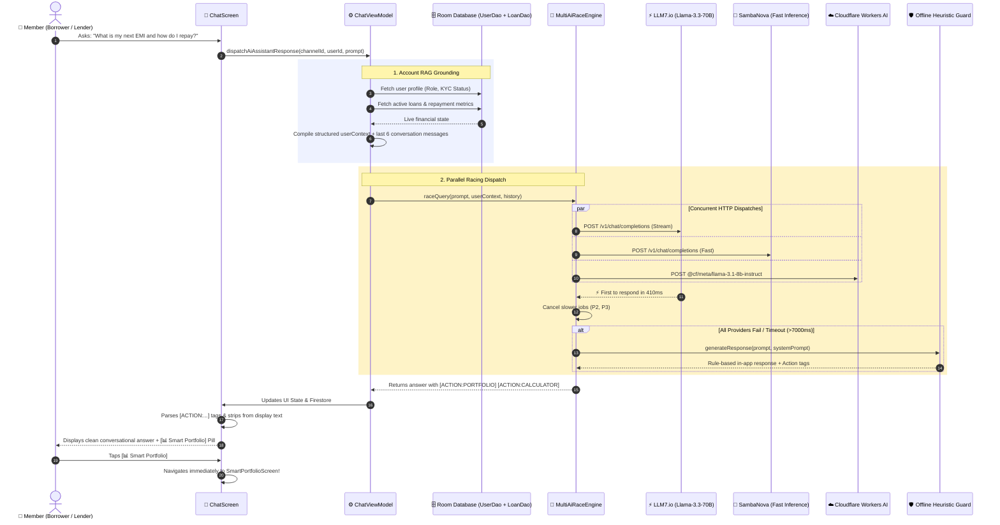

# 🤖 Loanzo AI Assistant & Multi-Model Racing Engine

> Comprehensive technical specification of Loanzo's parallel multi-model AI race architecture, in-app account grounding (RAG), and interactive conversational action system.

---

## 1. Architectural Philosophy

Traditional single-provider AI implementations suffer from **unpredictable API latency**, **rate-limiting outages**, and **generic hallucinated answers**. 

Loanzo solves this with a **3-Way Parallel Multi-Model Racing Engine** paired with **Client-Side Account RAG (Retrieval-Augmented Generation)**:



---

## 2. The 3 AI Providers in the Race

| Provider | Model | Latency Profile | Primary Role |
| :--- | :--- | :--- | :--- |
| **LLM7.io** | `Llama-3.3-70B-Instruct` | 350ms – 700ms | High-precision reasoning, complex financial calculations, contract analysis |
| **SambaNova Systems** | `Meta-Llama-3.1-70B-Instruct` | 250ms – 500ms | Ultra-fast token-generation speed, immediate response winner |
| **Cloudflare Workers AI** | `@cf/meta/llama-3.1-8b-instruct` | 400ms – 800ms | Edge-distributed fallback, high availability serverless inference |
| **Offline Heuristic Guard** | Rule-Based Kotlin Engine | 0ms (Instant) | Deterministic fallback when airplane mode / offline or all remote APIs fail |

---

## 3. Account RAG Context Injection

When a user messages the AI Assistant (`support_loanzo_assistant` or `LOANZO_BOT`), `ChatViewModel` dynamically queries local Room DAOs to assemble a structured account snapshot before dispatching the prompt:

```text
### USER LIVE ACCOUNT CONTEXT:
User Name: Rajesh Kumar | Role: Borrower
KYC Status: VERIFIED
Total Loans on File: 2 (1 currently active)
Active Loans Summary:
• Loan #L-4821 as Borrower: Principal ₹50,000, Outstanding ₹37,500, Rate: 12% p.a., Tenure: 12 mos, Status: ACTIVE_SERVICING, Purpose: Small Business Inventory Expansion
```

This ensures the AI never responds with vague generic advice — it directly addresses the user's specific loans, balances, and due dates.

---

## 4. Interactive Action Buttons (Deep-Link Navigation)

Rather than just displaying text, the bot emits structured **Action Tags** at the end of responses. `ChatScreen` strips these tags from the speech text and renders them as clickable, pill-shaped action buttons:

| Action Tag | Button Label | Icon | Destination Route |
| :--- | :--- | :--- | :--- |
| `[ACTION:CALCULATOR]` | Open Loan Calculator | `Icons.Default.Calculate` | `Routes.LOAN_CALCULATOR` |
| `[ACTION:KYC]` | Complete KYC | `Icons.Default.VerifiedUser` | `Routes.KYC` |
| `[ACTION:MARKETPLACE]` | Explore Marketplace | `Icons.Default.Groups` | `Routes.MARKETPLACE` |
| `[ACTION:PORTFOLIO]` | Smart Portfolio | `Icons.Default.PieChart` | `Routes.SMART_PORTFOLIO` |
| `[ACTION:CREATE_POST]` | Post Loan Request | `Icons.Default.AddCircle` | `Routes.CREATE_MARKETPLACE_POST` |
| `[ACTION:TELEGRAM]` | Telegram Alerts | `Icons.Default.Send` | Direct Telegram Bot Linking |

---

## 5. Offline Heuristic Guard

When no network connection is available or if all 3 remote AI providers fail to respond within `timeoutMs = 7000ms`, `OfflineHeuristicProvider` intercepts the query with keyword intent matching:

- **Borrowing / Application queries**: Explains KYC prerequisites, '+' button on navigation bar, and Community Marketplace.
- **Lending / Investment queries**: Explains browsing Borrower requests, trust score inspection, and state usury caps.
- **EMI / Calculations**: Explains reducing balance EMI formula and emits `[ACTION:CALCULATOR]`.
- **KYC & Identity**: Details the 3-step verification process (PAN, Aadhaar XML, Liveness).
- **Repayment & UPI**: Details direct peer UPI transfers, UTR recording, and digital NOC issuance.
