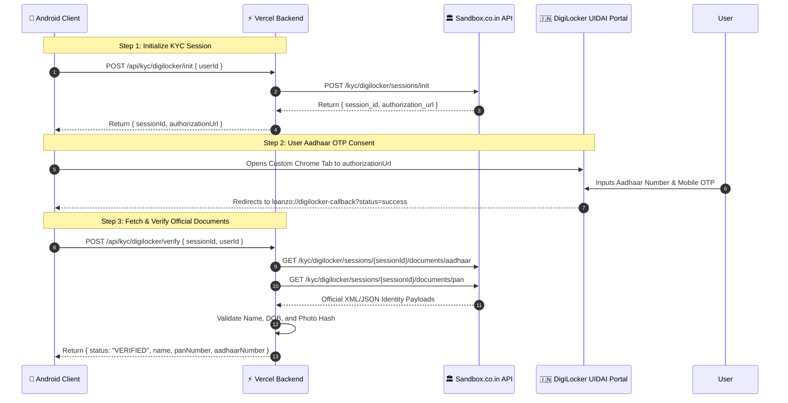

# 🌐 Loanzo API, Webhook & Integration Specification

<div align="center">

### **Backend Microservices, Payment Gateways & External Integrations**
*Complete technical specification of the Vercel Node.js microservice endpoints, Telegram Bot Webhook, Sandbox.co.in DigiLocker proxy, and NPCI UPI dynamic QR formats.*

---

[](https://backend-blond-sigma-66.vercel.app)
[](https://nodejs.org)
[](https://t.me/Loanzo_bot)
[](https://www.npci.org.in)

</div>

---

## 📑 Table of Contents
1. [Architecture Overview & Base URL](#1-architecture-overview--base-url)
2. [User Identity & Synchronization Endpoints](#2-user-identity--synchronization-endpoints)
3. [Authentication & Verification Services](#3-authentication--verification-services)
   - 3.1 [Truecaller OAuth 2.0 Token Exchange](#31-truecaller-oauth-20-token-exchange)
   - 3.2 [Nodemailer SMTP Email OTP Dispatcher](#32-nodemailer-smtp-email-otp-dispatcher)
4. [DigiLocker KYC Gateway (Sandbox.co.in Proxy)](#4-digilocker-kyc-gateway-sandboxcoin-proxy)
5. [Telegram Bot Webhook & Event Router (@Loanzo_bot)](#5-telegram-bot-webhook--event-router-loanzobot)
6. [NPCI Dynamic UPI QR Code Specification (`upi://pay`)](#6-npci-dynamic-upi-qr-code-specification-upipay)
7. [Cloud Firestore Collections & Security Protocol](#7-cloud-firestore-collections--security-protocol)
8. [Multi-AI Inference Endpoints & Payload Contracts](#8-multi-ai-inference-endpoints--payload-contracts)

---

## 1. Architecture Overview & Base URL

The Loanzo backend service is an event-driven Node.js/Express microservice deployed serverlessly on **Vercel**:

- **Production Base URL**: `https://backend-blond-sigma-66.vercel.app`
- **Protocol**: HTTPS / TLS 1.3
- **Content-Type**: `application/json`
- **CORS Policy**: Enabled (`cors()`) for mobile client access and administrative dashboards.

```
                         ┌──────────────────────────────────────────────┐
                         │           Loanzo Android Application         │
                         └──────────────────────┬───────────────────────┘
                                                │
                                HTTPS JSON REST │ API Requests
                                                ▼
                         ┌──────────────────────────────────────────────┐
                         │   Vercel Node.js Serverless Microservice     │
                         │   (https://backend-blond-sigma-66.vercel.app)│
                         └──────┬───────────────┬───────────────┬───────┘
                                │               │               │
            ┌───────────────────┘               │               └───────────────────┐
            ▼                                   ▼                                   ▼
┌───────────────────────┐           ┌───────────────────────┐           ┌───────────────────────┐
│ 🏛️ Sandbox.co.in      │           │ 🤖 Telegram Bot API   │           │ 📞 Truecaller OAuth   │
│ (DigiLocker KYC Proxy)│           │ (@Loanzo_bot Webhook) │           │ (Token Exchange Gate) │
└───────────────────────┘           └───────────────────────┘           └───────────────────────┘
```

---

## 2. User Identity & Synchronization Endpoints

### 2.1 Sync / Upsert User Profile
Updates or inserts a user's profile state from the Android local Room database to the online persistent store.

- **Method**: `POST`
- **Path**: `/api/users/sync`
- **Request Headers**: `Content-Type: application/json`

#### Request Payload:
```json
{
  "userId": "usr_1789182391_a9f1b2",
  "name": "Satyam Sharma",
  "email": "satyam@loanzo.app",
  "phone": "+919876543210",
  "role": "LENDER",
  "kycStatus": "VERIFIED",
  "panNumber": "ABCDE1234F",
  "aadhaarVerified": true,
  "selfieVerified": true,
  "upiId": "satyam@okaxis",
  "bankAccountNumber": "919876543210",
  "ifscCode": "PYTM0123456",
  "trustScore": 780,
  "telegramChatId": 8234574147
}
```

#### Response (200 OK):
```json
{
  "success": true,
  "message": "User synchronized successfully",
  "user": {
    "userId": "usr_1789182391_a9f1b2",
    "name": "Satyam Sharma",
    "role": "LENDER",
    "kycStatus": "VERIFIED",
    "updatedAt": 1789182395000
  }
}
```

---

### 2.2 Get User by ID
Retrieves a synchronized user profile by their unique ID.

- **Method**: `GET`
- **Path**: `/api/users/:userId`

#### Response (200 OK):
```json
{
  "success": true,
  "user": {
    "userId": "usr_1789182391_a9f1b2",
    "name": "Satyam Sharma",
    "phone": "+919876543210",
    "role": "LENDER",
    "kycStatus": "VERIFIED",
    "trustScore": 780
  }
}
```

#### Error Response (404 Not Found):
```json
{
  "success": false,
  "error": "User not found online"
}
```

---

### 2.3 Lookup User by Phone Number
Performs a counterparty lookup by phone number during loan origination.

- **Method**: `GET`
- **Path**: `/api/users/by-phone/:phone`

---

## 3. Authentication & Verification Services

### 3.1 Truecaller OAuth 2.0 Token Exchange
Exchanges an authorization code and PKCE code verifier for verified profile data from Truecaller's identity network.

- **Method**: `POST`
- **Path**: `/api/auth/truecaller`

#### Request Payload:
```json
{
  "authorization_code": "auth_code_xyz123...",
  "code_verifier": "pkce_verifier_string_456..."
}
```

#### Response (200 OK):
```json
{
  "success": true,
  "user": {
    "userId": "usr_1789182391_a9f1b2",
    "name": "Satyam Sharma",
    "phone": "+919876543210",
    "email": "satyam@gmail.com",
    "role": "BORROWER",
    "kycStatus": "PENDING"
  }
}
```

---

### 3.2 Nodemailer SMTP Email OTP Dispatcher
Dispatches 6-digit cryptographic one-time passwords via authenticated SMTP (Gmail / Custom SMTP).

- **Method**: `POST`
- **Path**: `/api/auth/send-email-otp`

#### Request Payload:
```json
{
  "email": "borrower@domain.com",
  "otp": "492815"
}
```

#### Response (200 OK):
```json
{
  "success": true,
  "message": "Verification email sent to borrower@domain.com. Please check your inbox."
}
```

---

## 4. DigiLocker KYC Gateway (Sandbox.co.in Proxy)

To protect production API secrets (`SANDBOX_API_KEY`, `SANDBOX_API_SECRET`), all DigiLocker transactions are proxied through the serverless backend.



### Endpoints Specification:

#### 4.1 Init DigiLocker Session
- **POST** `/api/kyc/digilocker/init`
- **Body**: `{ "userId": "usr_123" }`
- **Response**: `{ "success": true, "sessionId": "sess_8912", "authorizationUrl": "https://..." }`

#### 4.2 Check Session Status
- **GET** `/api/kyc/digilocker/status/:sessionId`
- **Response**: `{ "success": true, "status": "completed", "data": { ... } }`

#### 4.3 Retrieve & Verify Documents
- **POST** `/api/kyc/digilocker/verify`
- **Body**: `{ "sessionId": "sess_8912", "userId": "usr_123" }`
- **Response**:
```json
{
  "success": true,
  "status": "VERIFIED",
  "message": "DigiLocker Aadhaar & PAN Verified via Sandbox.co.in",
  "name": "Satyam Sharma",
  "panNumber": "ABCDE1234F",
  "aadhaarNumber": "XXXXXXXX4912",
  "dateOfBirth": "1998-08-10",
  "address": "B-42, Connaught Place, New Delhi 110001"
}
```

---

## 5. Telegram Bot Webhook & Event Router (@Loanzo_bot)

Loanzo operates an interactive Telegram bot (`@Loanzo_bot`) providing 24/7 account management, instant alerts, and administrative control.

- **Webhook URL**: `https://backend-blond-sigma-66.vercel.app/api/telegram/webhook`
- **Method**: `POST`

### 5.1 Supported Inbound Commands

| Command | Role Level | Functional Behavior |
| :--- | :--- | :--- |
| `/start` | Public | Welcome message, bot command list, and deep-link account binding via `/start OTT_<token>`. |
| `/myloans` | Verified User | Queries active loan portfolio for caller's `chat.id`, displaying balance and next EMI. |
| `/repay` | Verified User | Generates instant UPI settlement instructions and dynamic payment links. |
| `/statement`| Verified User | Formats recent repayments, on-time performance, and penal charge summary. |
| `/help` | Public | Returns customer grievance contact details and platform operating guidelines. |
| `/stats` | Master Admin | Returns platform metrics: total active loans, capital deployed, and default rate. |
| `/pendingkyc`| Master Admin | Lists pending field agent applications and unverified user queues. |
| `/admin` | Master Admin | Master control panel for administrative operations. |

### 5.2 Outbound Targeted Notification Endpoint
Allows the Android app and system workers to dispatch real-time push alerts to users via Telegram:

- **Method**: `POST`
- **Path**: `/api/telegram/notify`

#### Request Payload:
```json
{
  "chatId": 8234574147,
  "message": "🚨 *Loanzo EMI Deadline Alert*\n\nYour EMI of *₹4,850* for Loan #LN-4819 is due tomorrow.\n\nTap below to settle instantly via UPI:",
  "actionButtons": [
    {
      "text": "📲 Pay via UPI",
      "url": "https://backend-blond-sigma-66.vercel.app/repay/LN-4819"
    }
  ]
}
```

---

## 6. NPCI Dynamic UPI QR Code Specification (`upi://pay`)

Settlements in Loanzo are executed directly through the **NPCI Unified Payments Interface (UPI)** network, eliminating intermediaries:

### URI Format:
```
upi://pay?pa={merchantVpa}&pn={merchantName}&am={amount}&tn={transactionNote}&cu=INR
```

### Parameter Specification:
| Parameter Key | Name | Example Value | Description |
| :--- | :--- | :--- | :--- |
| `pa` | Payee Address | `loanzo.escrow@icici` | Recipient Virtual Payment Address (VPA). |
| `pn` | Payee Name | `Loanzo Escrow Account` | Registered legal business or counterparty name. |
| `am` | Amount | `4850.00` | Exact repayment or disbursement amount in INR (2 decimals). |
| `tn` | Transaction Note | `EMI-LN4819-INST3` | Structured reference tag embedding the loan and installment ID. |
| `cu` | Currency | `INR` | Standard ISO 4217 currency code. |

### Dynamic QR Generation inside Android Client:
The Compose component `UpiQrCodeDialog.kt` dynamically encodes this standard URI into a high-density QR bitmap (`ZXing` / Android Canvas) rendered on-screen for counter-app scanning.

---

## 7. Cloud Firestore Collections & Security Protocol

Cloud Firestore provides real-time cross-device messaging and sync backups:

```
firestore/
├── users/
│   └── {userId} (Profile document, KYC status, trust score)
├── loans/
│   └── {loanId} (Contract terms, agreed status, PDF URL, KFS hash)
├── repayments/
│   └── {repaymentId} (Installment record, UTR proof, paid date)
├── marketplace_posts/
│   └── {postId} (Social timeline loan pitches & lending offers)
│       └── bids/
│           └── {bidId} (Competing lender proposals)
└── chat_channels/
    └── {channelId} (P2P counterparty negotiation messages)
        └── messages/
            └── {messageId} (Timestamped chat message)
```

### Declarative Security Invariant:
- Users may read public `marketplace_posts` and approved public user profiles.
- Loan contracts and repayments may **only** be read or written by the designated `lenderId`, `borrowerId`, or verified Master Admin.

---

## 8. Multi-AI Inference Endpoints & Payload Contracts

The `MultiAiRaceEngine.kt` queries three inference clusters simultaneously using standard OpenAI-compatible API schemas:

| Provider | Model Identifier | Base Endpoint |
| :--- | :--- | :--- |
| **LLM7.io** | `llama-3.3-70b-versatile` | `https://api.llm7.io/v1/chat/completions` |
| **SambaNova Systems** | `Meta-Llama-3.1-70B-Instruct` | `https://api.sambanova.ai/v1/chat/completions` |
| **Cloudflare Workers AI** | `@cf/meta/llama-3-8b-instruct` | `https://api.cloudflare.com/client/v4/accounts/{id}/ai/run` |

#### Standard JSON Request:
```json
{
  "model": "llama-3.3-70b-versatile",
  "messages": [
    {
      "role": "system",
      "content": "You are the Loanzo Financial Assistant... [Live Account RAG Context]"
    },
    {
      "role": "user",
      "content": "How do I calculate interest on a ₹50,000 loan?"
    }
  ],
  "temperature": 0.2,
  "max_tokens": 400
}
```

---

<div align="center">
<b>Loanzo API & Integration Engineering</b> • Production Endpoint Reference
</div>
