# Engineering Report: Banking-Grade Session Management & Zero-Glitch Startup Warm-up Architecture

**Project**: Loanzo — Institutional P2P Lending & Decentralized Credit Platform  
**Target Release**: v1.4.0 (Production Candidate)  
**Classification**: Security & Architecture Engineering Report  

---

## 1. Executive Summary

Mobile financial and banking applications require stringent operational reliability and security invariants. Users handling sensitive financial transactions must not encounter mid-render screen jumps, visual layout shifts, or premature session terminations when multi-tasking.

This engineering report documents the implementation of:
1. **The Parallel Startup Warm-up Engine (`SplashWarmupCoordinator`)**: Converts the mandatory 3.5-second cinematic entrance animation into an asynchronous IO priming pipeline, eliminating cold-start screen jumps and white screen flashes.
2. **Bank-Grade Session Lifecycle Management (`BankingSessionManager`)**: Modeled after Tier-1 banking applications (HDFC Bank, CRED, Revolut, Chase), featuring a 3-minute background multi-tasking grace window, non-destructive Biometric/PIN quick unlock, a 2-day hard session expiration policy, and cryptographic hardware device binding.

---

## 2. Problem Statement: The Cold-Start Screen Jump & Glitch Dilemma

In earlier versions of mobile application startup architectures:
- The splash screen played an entrance animation for a fixed duration, and upon completion immediately commanded `navController.navigate(Routes.MAIN)`.
- However, at the instant `MainScaffold` and `DashboardScreen` were mounted, underlying storage mechanisms (`Room Database`, `AndroidX DataStore`) were still executing cold disk reads.
- Consequently, the UI initially rendered in an uninitialized state:
  - User greetings briefly flashed empty ("Welcome, ") before jumping to the user's name ("Welcome, Satya").
  - Financial metric cards displayed zero values or spinning indicators before snapping to actual values 150–300ms later.
  - If a device was unauthorized or session tokens were invalid, the app rendered the dashboard for a fraction of a second before suddenly jumping backwards to the login or grievance screen ("automatic mid-flight screen jump").

---

## 3. Technical Solution: Parallel Warm-up Engine (`SplashWarmupCoordinator`)

### 3.1 Concurrency Model
Rather than delaying first and querying second, Loanzo utilizes structured coroutine concurrency (`kotlinx.coroutines.coroutineScope` and `async / await`):

$$\text{Total Splash Wait} = \max(T_{\text{cinematic}} = 3500\text{ ms}, \; T_{\text{warmup IO}})$$

Because database and hardware operations complete in $120\text{ ms} - 450\text{ ms}$, the entire IO pipeline finishes well within the 3,500 ms visual animation window.

```mermaid
gantt
    title Cold Startup Concurrency Timeline (3.5 Seconds)
    dateFormat  X
    axisFormat %s ms

    section Visual Thread (UI)
    Spring-Loaded Entrance Logo Pop       :0, 600
    Dual Counter-Rotating Orbital Rings   :0, 3500
    Radar Pulse & Breathing Aura          :0, 3500
    Real-Time Security Clearance Updates  :0, 3500

    section Background IO Pipeline (Dispatchers.IO)
    Stage 1 - Hardware Cryptographic Audit :0, 1100
    Stage 2 - Banking Session Vault Check  :1100, 2200
    Stage 3 - Database Cache Priming       :2200, 3300
    Stage 4 - Deterministic Route Decision :3300, 3500

    section Navigation Dispatch
    Single-Shot Atomic Navigation          :milestone, 3500, 0
```



### 3.2 Cold-to-Hot Database Priming
During Stage 3, the coordinator actively invokes queries across Room DAOs:
- `UserDao.getUserById(userId)`
- `LoanDao.getAllLoansForUser(userId)`
- `NotificationDao.getUnreadCount(userId)`

When navigation dispatches to `Routes.MAIN`, Room's in-memory cache already holds the latest state, allowing Jetpack Compose to render the dashboard's very first frame with 100% complete data.

---

## 4. Banking-Grade Session Lifecycle Management

### 4.1 Inactivity Auto-Lock (3-Minute Grace Window)
When users temporarily switch away from Loanzo to copy an OTP from an SMS or retrieve an IFSC code, they are within the **3-Minute Grace Window** ($T_{\text{grace}} = 180\text{ seconds}$). Returning within this window preserves their active screen state immediately without re-authentication.

If the app remains backgrounded for $\ge 180\text{ seconds}$, the session transitions to `SessionState.LOCKED`.

```mermaid
stateDiagram-v2
    [*] --> UNAUTHENTICATED
    UNAUTHENTICATED --> ACTIVE: Valid Login / 2FA
    
    state ACTIVE {
        [*] --> InApp
        InApp --> ScreenOffOrBackground: App Minimized
    }

    state ScreenOffOrBackground {
        [*] --> Timer: Elapsed Background Time
        Timer --> ACTIVE: Resumed < 180s (Grace Window)
        Timer --> LOCKED: Resumed >= 180s (Inactivity Lock)
        Timer --> EXPIRED: Resumed > 48h (Hard Session Expiry)
    }

    state LOCKED {
        [*] --> BiometricOverlay: SessionLockScreen Mounted
        BiometricOverlay --> ACTIVE: Fingerprint / Face ID / PIN Success
        BiometricOverlay --> UNAUTHENTICATED: Explicit Log Out / Switch Account
    }

    EXPIRED --> UNAUTHENTICATED: Purge Tokens -> Route to Login
```

### 4.2 Hard Session Expiry (2-Day / 48-Hour Invariant)
To protect abandoned devices or stale tokens from remaining indefinitely valid, any session with no activity for **> 2 days (48 hours = 172,800,000 ms)** is permanently invalidated. All persisted tokens in `bankingSessionDataStore` and `loanzo_prefs` are cleared, requiring full re-authentication.

### 4.3 Hardware Device Binding Anchor
To prevent session hijacking across cloned devices or emulators, each session is cryptographically bound to the unique hardware signature:

$$\text{Device UID} = \text{SHA-256}(\text{AndroidID} \parallel \text{MANUFACTURER} \parallel \text{MODEL} \parallel \text{BOARD})$$

If a session is restored on an unrecognized device, the `SplashWarmupCoordinator` catches the mismatch during Stage 1 and immediately routes to the security grievance flow (`Routes.FORGOT_PASSWORD` Step 6) before rendering any user balances.

---

## 5. Summary of Key Files

| File | Package | Functional Description |
| :--- | :--- | :--- |
| `BankingSessionManager.kt` | `com.loanzo.app.data.session` | Singleton tracking inactivity timer (3m), hard expiry (2d), and device binding. |
| `SplashWarmupCoordinator.kt` | `com.loanzo.app.util` | Asynchronous IO warm-up engine running parallel to the 3.5s logo splash animation. |
| `SessionLockScreen.kt` | `com.loanzo.app.ui.auth` | Non-destructive Biometric & 4-digit PIN Quick Unlock Shield. |
| `NavGraph.kt` | `com.loanzo.app.ui.navigation` | Single-shot atomic navigation dispatch and reactive session state observer. |
| `MainActivity.kt` | `com.loanzo.app` | Registers lifecycle callbacks and user touch interaction tracking. |

---

## 6. Verification & Test Matrix

| Test Case | Precondition | Action | Expected Behavior |
| :--- | :--- | :--- | :--- |
| **Cold App Launch** | App terminated | Launch app from app drawer | 3.5s cinematic animation plays smoothly. Zero layout shifts or spinners upon dashboard appearance. |
| **Short Multi-Tasking (< 3m)** | App on Dashboard | Minimize for 15s to check SMS, return | Resumes immediately on Dashboard with zero lock screen and zero reload. |
| **Background Auto-Lock (> 3m)** | App on Dashboard | Minimize for > 3 minutes, return | `SessionLockScreen` appears asking for Fingerprint / PIN. Verifying restores Dashboard state. |
| **Hard Expiry (> 2 days)** | App on Dashboard | Inactivity exceeds 48 hours, return | Session purged; routes cleanly to `Routes.LOGIN`. |
| **Device Tampering / Clone** | Session copied to new device | Launch on mismatched hardware UID | Immediately routes to Untrusted Device Grievance; blocks dashboard access. |
