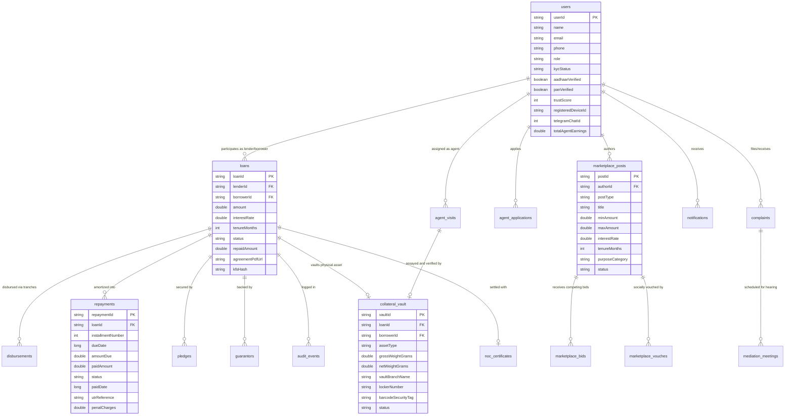
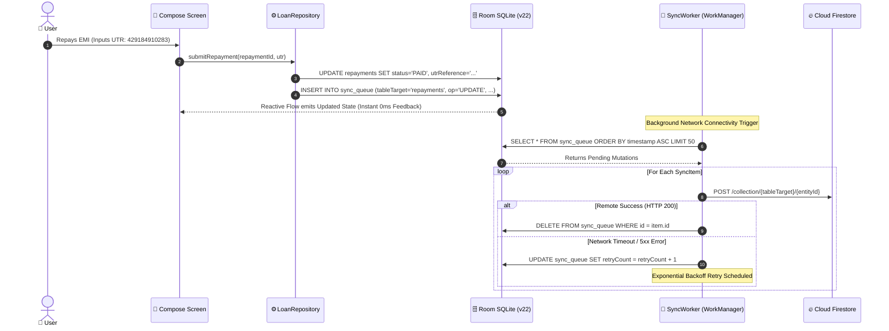

# 🗄️ Loanzo Database Schema, Relational Entities & Migration Reference

<div align="center">

### **Room SQLite Engine v22 & Cloud Sync Architecture**
*Exhaustive technical documentation of local database entities, relational models, indexing strategies, foreign key constraints, and background cloud sync protocols.*

---

[](https://developer.android.com/training/data-storage/room)
[](https://sqlite.org)
[](https://kotlinlang.org)
[](https://firebase.google.com)

</div>

---

## 📑 Table of Contents
1. [Architectural Overview & Offline-First Principles](#1-architectural-overview--offline-first-principles)
2. [Master Entity-Relationship (ER) Diagram](#2-master-entity-relationship-er-diagram)
3. [Exhaustive Entity Table Specifications (All 23 Tables)](#3-exhaustive-entity-table-specifications-all-23-tables)
   - 3.1 [Core User & Identity Subsystem](#31-core-user--identity-subsystem)
   - 3.2 [Loan Origination, Repayment & Audit Subsystem](#32-loan-origination-repayment--audit-subsystem)
   - 3.3 [Community Social Marketplace Subsystem](#33-community-social-marketplace-subsystem)
   - 3.4 [Certified Field Agent & Doorstep Verification Subsystem](#34-certified-field-agent--doorstep-verification-subsystem)
   - 3.5 [Collateral Vault, Escrow & NOC Clearance Subsystem](#35-collateral-vault-escrow--noc-clearance-subsystem)
   - 3.6 [Dispute Resolution, Grievance & Mediation Subsystem](#36-dispute-resolution-grievance--mediation-subsystem)
   - 3.7 [In-App Notifications & Background Sync Subsystem](#37-in-app-notifications--background-sync-subsystem)
4. [Indexing & Query Optimization Strategy](#4-indexing--query-optimization-strategy)
5. [Database Migrations & Fallback Lifecycle](#5-database-migrations--fallback-lifecycle)
6. [Offline-to-Cloud Sync Engine (`SyncQueueEntity`)](#6-offline-to-cloud-sync-engine-syncqueueentity)

---

## 1. Architectural Overview & Offline-First Principles

Loanzo's data layer is designed around an **Offline-First Reactive Model** managed by Android Room SQLite (`LoanzoDatabase`, version 22).

```
   ┌────────────────────────────────────────────────────────┐
   │             Jetpack Compose UI Screens                 │
   └───────────────────────────▲────────────────────────────┘
                               │ Observes UI StateFlow
   ┌───────────────────────────┴────────────────────────────┐
   │                  Dagger-Hilt ViewModels                │
   └───────────────────────────▲────────────────────────────┘
                               │ Queries Kotlin Flows
   ┌───────────────────────────┴────────────────────────────┐
   │               Repository Abstraction Layer             │
   └───────────────▲────────────────────────▲───────────────┘
                   │                        │
       Local Read/Write Flow        Queues Background Sync
                   │                        │
   ┌───────────────▼───────────┐  ┌─────────▼───────────────┐
   │  Room SQLite DB v22       │  │ SyncQueueEntity Table   │
   │  (Single Source of Truth) │  └─────────┬───────────────┘
   └───────────────────────────┘            │ SyncWorker
                                            ▼
                                  ┌─────────────────────────┐
                                  │ Cloud Firestore & Drive │
                                  └─────────────────────────┘
```

### Key Architectural Invariants:
1. **Single Source of Truth**: The local Room SQLite database is the only direct data source observed by ViewModels and rendered by Compose screens. Network latency never blocks UI rendering.
2. **Deterministic Foreign Key Integrity**: Relationships between Loans, Repayments, Collateral, and Guarantors are governed by foreign key constraints with index-backed lookups.
3. **Reactive Streams**: Room DAOs emit Kotlin `Flow<T>`, ensuring that any background sync insertion or local edit automatically updates all active UI components without manual polling.

---

## 2. Master Entity-Relationship (ER) Diagram



---

## 3. Exhaustive Entity Table Specifications (All 23 Tables)

### 3.1 Core User & Identity Subsystem

#### 1. `users` (`UserEntity`)
Stores consumer profiles, multi-role configurations, DigiLocker verification states, and device security bindings.

| Column Name | SQLite Data Type | Nullable | Description & Constraints |
| :--- | :--- | :---: | :--- |
| `userId` | `TEXT` | ❌ **PK** | Unique User UUID / Firebase UID. |
| `name` | `TEXT` | ❌ | Full legal name matching Aadhaar/PAN records. |
| `email` | `TEXT` | ❌ | Primary contact email address. |
| `phone` | `TEXT` | ❌ | E.164 normalized mobile number (+91...). |
| `role` | `TEXT` | ❌ | User role: `BORROWER`, `LENDER`, `AGENT`, `ADMIN`. |
| `kycStatus` | `TEXT` | ❌ | Verification status: `PENDING`, `SUBMITTED`, `VERIFIED`, `REJECTED`. |
| `aadhaarNumber` | `TEXT` | ✔️ | Encrypted or masked 12-digit UIDAI number. |
| `panNumber` | `TEXT` | ✔️ | 10-digit alphanumeric permanent account number. |
| `aadhaarVerified` | `INTEGER` (Bool) | ❌ | Flag indicating valid DigiLocker OTP signature. |
| `panVerified` | `INTEGER` (Bool) | ❌ | Flag indicating valid NSDL database match. |
| `selfieVerified` | `INTEGER` (Bool) | ❌ | Flag indicating valid ML Kit on-device liveness check. |
| `trustScore` | `INTEGER` | ❌ | Algorithmic social credit score (300 to 900). |
| `registeredDeviceId` | `TEXT` | ✔️ | Cryptographic hardware hash (`androidId` + signature). |
| `telegramChatId` | `INTEGER` | ✔️ | Authenticated Telegram user ID for `@Loanzo_bot` alerts. |
| `upiId` | `TEXT` | ✔️ | Primary Virtual Payment Address (e.g., `user@okaxis`). |
| `bankAccountNumber` | `TEXT` | ✔️ | Masked bank account for electronic settlement. |
| `ifscCode` | `TEXT` | ✔️ | 11-digit bank branch IFSC code. |
| `agentApproved` | `INTEGER` (Bool) | ❌ | True if certified field agent application is active. |
| `totalAgentEarnings` | `REAL` | ❌ | Cumulative payout earned from doorstep verification visits (₹). |
| `createdAt` | `INTEGER` | ❌ | Unix epoch millisecond timestamp. |
| `updatedAt` | `INTEGER` | ❌ | Last modification epoch millisecond timestamp. |

---

### 3.2 Loan Origination, Repayment & Audit Subsystem

#### 2. `loans` (`LoanEntity`)
Governs active, settled, and defaulted peer-to-peer loan facilities.

| Column Name | SQLite Data Type | Nullable | Description & Constraints |
| :--- | :--- | :---: | :--- |
| `loanId` | `TEXT` | ❌ **PK** | UUID identifying the loan contract. |
| `lenderId` | `TEXT` | ❌ | Counterparty User ID of the capital provider. |
| `borrowerId` | `TEXT` | ❌ | Counterparty User ID of the fund recipient. |
| `amount` | `REAL` | ❌ | Principal loan amount (₹). Minimum ₹500, Max ₹10,00,000. |
| `interestRate` | `REAL` | ❌ | Annualized Percentage Rate (APR). Bounded: 9.0% to 18.0%. |
| `tenureMonths` | `INTEGER` | ❌ | Repayment horizon in calendar months (1 to 36). |
| `purpose` | `TEXT` | ❌ | Loan classification: `MEDICAL`, `EDUCATION`, `BUSINESS`, etc. |
| `status` | `TEXT` | ❌ | State: `PROPOSED`, `ACCEPTED`, `SIGNED`, `ACTIVE`, `REPAID`, `DEFAULTED`. |
| `repaidAmount` | `REAL` | ❌ | Cumulative principal and regular interest repaid to date (₹). |
| `disbursementMethod`| `TEXT` | ❌ | Method: `UPI_ESCROW`, `DIRECT_PAYEE_TRANCHE`, `BANK_IMPS`. |
| `agreementPdfUrl` | `TEXT` | ✔️ | Local or Google Drive URI of the dual-signed promissory note. |
| `kfsHash` | `TEXT` | ✔️ | 64-character SHA-256 digest of Key Fact Statement. |
| `createdAt` | `INTEGER` | ❌ | Facility origination timestamp. |

#### 3. `disbursements` (`DisbursementEntity`)
Tracks purpose-bound milestone tranches released to verified payees.

| Column Name | SQLite Data Type | Nullable | Description & Constraints |
| :--- | :--- | :---: | :--- |
| `disbursementId` | `TEXT` | ❌ **PK** | UUID for specific disbursement tranche. |
| `loanId` | `TEXT` | ❌ **FK** | Foreign key linking to parent `loans.loanId`. |
| `trancheNumber` | `INTEGER` | ❌ | Ordinal milestone indicator (1, 2, 3...). |
| `amount` | `REAL` | ❌ | Tranche capital amount (₹). |
| `payeeId` | `TEXT` | ❌ **FK** | Foreign key linking to verified institutional `payees`. |
| `invoiceProofUrl`| `TEXT` | ✔️ | Cached URI of hospital, tuition, or raw material invoice. |
| `utrReference` | `TEXT` | ✔️ | 12-digit Unique Transaction Reference from banking network. |
| `status` | `TEXT` | ❌ | Status: `PENDING_INVOICE`, `APPROVED`, `DISBURSED`. |
| `disbursedAt` | `INTEGER` | ✔️ | Execution timestamp. |

#### 4. `repayments` (`RepaymentEntity`)
Defines the reducing-balance monthly amortization schedule and penalty records.

| Column Name | SQLite Data Type | Nullable | Description & Constraints |
| :--- | :--- | :---: | :--- |
| `repaymentId` | `TEXT` | ❌ **PK** | UUID for the specific monthly installment. |
| `loanId` | `TEXT` | ❌ **FK** | Foreign key linking to `loans.loanId`. |
| `installmentNumber`| `INTEGER` | ❌ | Month index (1 to $N$). |
| `dueDate` | `INTEGER` | ❌ | Due date epoch millisecond timestamp. |
| `amountDue` | `REAL` | ❌ | Computed EMI obligation (Principal + Regular Interest). |
| `principalPortion` | `REAL` | ❌ | Principal component of the installment. |
| `interestPortion` | `REAL` | ❌ | Interest component of the installment. |
| `paidAmount` | `REAL` | ❌ | Actual amount remitted by the borrower (₹). |
| `penalCharges` | `REAL` | ❌ | RBI-compliant penal charges accrued (capped at 2% monthly). |
| `status` | `TEXT` | ❌ | Status: `UPCOMING`, `DUE`, `PAID`, `OVERDUE`, `GRACE_PERIOD`. |
| `paidDate` | `INTEGER` | ✔️ | Payment confirmation timestamp. |
| `utrReference` | `TEXT` | ✔️ | Bank UTR reference input by payer. |

#### 5. `payees` (`PayeeEntity`)
Maintains institutional merchant endpoints for milestone escrow disbursal.

| Column Name | SQLite Data Type | Nullable | Description & Constraints |
| :--- | :--- | :---: | :--- |
| `payeeId` | `TEXT` | ❌ **PK** | Unique merchant identifier. |
| `merchantName` | `TEXT` | ❌ | Legal name (e.g., *Apollo Hospitals*, *Delhi Public School*). |
| `category` | `TEXT` | ❌ | Sector: `HEALTHCARE`, `EDUCATION`, `SUPPLIER`, `GOVERNMENT`. |
| `upiVpa` | `TEXT` | ❌ | Verified merchant UPI Virtual Payment Address. |
| `bankAccountNumber`| `TEXT` | ✔️ | Commercial account number. |
| `ifscCode` | `TEXT` | ✔️ | Branch IFSC. |
| `isKycVerified` | `INTEGER` (Bool) | ❌ | Flag confirming enterprise KYC validation. |

#### 6. `pledges` (`PledgeEntity`)
Defines security hypothecations tied to loan facilities.

| Column Name | SQLite Data Type | Nullable | Description & Constraints |
| :--- | :--- | :---: | :--- |
| `pledgeId` | `TEXT` | ❌ **PK** | Unique pledge identifier. |
| `loanId` | `TEXT` | ❌ **FK** | Foreign key linking to `loans.loanId`. |
| `assetType` | `TEXT` | ❌ | Type: `GOLD_JEWELRY`, `VEHICLE`, `PROPERTY_DEED`, `INVOICE`. |
| `declaredValue` | `REAL` | ❌ | Borrower self-declared valuation (₹). |
| `appraisedValue`| `REAL` | ✔️ | Field Agent verified valuation (₹). |
| `status` | `TEXT` | ❌ | Status: `DECLARED`, `APPRAISED`, `VAULTED`, `RELEASED`. |

#### 7. `guarantors` (`GuarantorEntity`)
Stores third-party personal guarantees backing unsecured loans.

| Column Name | SQLite Data Type | Nullable | Description & Constraints |
| :--- | :--- | :---: | :--- |
| `guarantorId` | `TEXT` | ❌ **PK** | Unique guarantor UUID. |
| `loanId` | `TEXT` | ❌ **FK** | Foreign key linking to `loans.loanId`. |
| `userId` | `TEXT` | ❌ **FK** | User ID of the guarantor. |
| `relationship` | `TEXT` | ❌ | Relationship: `COLLEAGUE`, `FAMILY`, `BUSINESS_PARTNER`. |
| `guaranteeLimit`| `REAL` | ❌ | Maximum financial liability undertaken (₹). |
| `isSigned` | `INTEGER` (Bool) | ❌ | Dual biometric signature status. |

#### 8. `audit_events` (`AuditEventEntity`)
Immutable tamper-evident append-only ledger for financial operations.

| Column Name | SQLite Data Type | Nullable | Description & Constraints |
| :--- | :--- | :---: | :--- |
| `eventId` | `TEXT` | ❌ **PK** | Unique audit UUID. |
| `loanId` | `TEXT` | ✔️ | Associated loan facility. |
| `actorId` | `TEXT` | ❌ | User ID of initiating party. |
| `action` | `TEXT` | ❌ | Action: `LOAN_CREATED`, `BID_ACCEPTED`, `ESIGN_COMPLETED`, `EMI_PAID`. |
| `payloadJson` | `TEXT` | ❌ | Full JSON snapshot of state transition. |
| `sha256Hash` | `TEXT` | ❌ | Cryptographic hash chaining previous event hash. |
| `timestamp` | `INTEGER` | ❌ | Epoch millisecond timestamp. |

---

### 3.3 Community Social Marketplace Subsystem

#### 9. `marketplace_posts` (`MarketplacePostEntity`)
Powers the public Lenme-style community bidding timeline.

| Column Name | SQLite Data Type | Nullable | Description & Constraints |
| :--- | :--- | :---: | :--- |
| `postId` | `TEXT` | ❌ **PK** | Unique post identifier UUID. |
| `authorId` | `TEXT` | ❌ **FK** | User ID of author. |
| `authorName` | `TEXT` | ❌ | Display name of author. |
| `authorKycVerified`| `INTEGER` (Bool)| ❌ | DigiLocker verification badge indicator. |
| `authorTrustScore` | `INTEGER` | ❌ | Algorithmic trust score. |
| `postType` | `TEXT` | ❌ | `OFFER_TO_LEND` (Lender pool) vs `SEEKING_LOAN` (Borrower pitch). |
| `title` | `TEXT` | ❌ | Concise summary headline. |
| `description` | `TEXT` | ❌ | Detailed purpose pitch. |
| `minAmount` | `REAL` | ❌ | Minimum acceptable transaction amount (₹). |
| `maxAmount` | `REAL` | ❌ | Maximum funding ceiling (₹). |
| `interestRate` | `REAL` | ❌ | Target APR (Statutorily bounded 9% to 18%). |
| `tenureMonths` | `INTEGER` | ❌ | Repayment period in months. |
| `purposeCategory` | `TEXT` | ❌ | `EDUCATION`, `MEDICAL`, `BUSINESS`, `EMERGENCY`, `PERSONAL`. |
| `locationCity` | `TEXT` | ✔️ | City / territory of the author. |
| `collateralOffered`| `TEXT` | ✔️ | Description of collateral offered (if any). |
| `vouchCount` | `INTEGER` | ❌ | Social vouches received from community. |
| `bidsCount` | `INTEGER` | ❌ | Count of active competing counter-offers. |
| `status` | `TEXT` | ❌ | Status: `OPEN`, `IN_NEGOTIATION`, `FUNDED`, `EXPIRED`. |
| `createdAt` | `INTEGER` | ❌ | Posting timestamp. |

#### 10. `marketplace_bids` (`MarketplaceBidEntity`)
Captures competitive counter-proposals placed on community posts.

| Column Name | SQLite Data Type | Nullable | Description & Constraints |
| :--- | :--- | :---: | :--- |
| `bidId` | `TEXT` | ❌ **PK** | Unique proposal identifier UUID. |
| `postId` | `TEXT` | ❌ **FK** | Foreign key linking to `marketplace_posts.postId`. |
| `bidderId` | `TEXT` | ❌ **FK** | User ID of bidding counterparty. |
| `bidderName` | `TEXT` | ❌ | Display name of bidder. |
| `bidderTrustScore` | `INTEGER` | ❌ | Trust score of bidder. |
| `proposedAmount` | `REAL` | ❌ | Bidded capital amount (₹). |
| `proposedInterestRate`| `REAL` | ❌ | Competitive APR offered (%). |
| `proposedTenureMonths`| `INTEGER` | ❌ | Proposed tenure in months. |
| `message` | `TEXT` | ✔️ | Accompanying personalized note. |
| `status` | `TEXT` | ❌ | Status: `PENDING`, `ACCEPTED`, `REJECTED`, `WITHDRAWN`. |
| `createdAt` | `INTEGER` | ❌ | Proposal submission timestamp. |

#### 11. `marketplace_vouches` (`MarketplaceVouchEntity`)
Maintains social trust attestations between network members.

| Column Name | SQLite Data Type | Nullable | Description & Constraints |
| :--- | :--- | :---: | :--- |
| `vouchId` | `TEXT` | ❌ **PK** | Unique vouch identifier. |
| `postId` | `TEXT` | ❌ **FK** | Foreign key to `marketplace_posts.postId`. |
| `voucherUserId` | `TEXT` | ❌ **FK** | User ID of the community member vouching. |
| `relationshipNote` | `TEXT` | ✔️ | Contextual testimony (*e.g., "Known borrower for 5 years"*). |
| `createdAt` | `INTEGER` | ❌ | Timestamp of vouch. |

---

### 3.4 Certified Field Agent & Doorstep Verification Subsystem

#### 12. `agent_applications` (`AgentApplicationEntity`)
Stores bank-grade empanelment applications for field valuers.

| Column Name | SQLite Data Type | Nullable | Description & Constraints |
| :--- | :--- | :---: | :--- |
| `applicationId` | `TEXT` | ❌ **PK** | Unique application identifier UUID. |
| `userId` | `TEXT` | ❌ **FK** | User ID of applicant. |
| `pccDate` | `TEXT` | ❌ | Police Clearance Certificate issue date. |
| `policeStation` | `TEXT` | ❌ | Name and jurisdiction of verifying police station. |
| `operatingRadiusKm`| `INTEGER` | ❌ | Operating coverage radius (5 km to 50 km). |
| `transportType` | `TEXT` | ❌ | Vehicle: `MOTORCYCLE`, `SCOOTER`, `CAR`, `PUBLIC_TRANSIT`. |
| `drivingLicenseNumber`| `TEXT`| ❌ | Verified RTO Driving License number. |
| `cleanRecordDeclaration`|`INTEGER` (Bool)| ❌ | Statutory legal declaration of no criminal record. |
| `status` | `TEXT` | ❌ | Status: `PENDING_REVIEW`, `APPROVED`, `REJECTED`. |
| `reviewedBy` | `TEXT` | ✔️ | Administrator who conducted interview/audit. |
| `submittedAt` | `INTEGER` | ❌ | Application timestamp. |

#### 13. `agent_visits` (`AgentVisitEntity`)
Schedules, tracks, and proves physical doorstep inspections and gold assaying.

| Column Name | SQLite Data Type | Nullable | Description & Constraints |
| :--- | :--- | :---: | :--- |
| `visitId` | `TEXT` | ❌ **PK** | Unique inspection task UUID. |
| `agentId` | `TEXT` | ❌ **FK** | User ID of assigned certified agent. |
| `counterpartyName`| `TEXT` | ❌ | Legal name of person being inspected. |
| `counterpartyPhone`| `TEXT` | ❌ | Contact telephone number. |
| `visitType` | `TEXT` | ❌ | `COLLATERAL_VERIFICATION`, `BORROWER_RESIDENCE`, `LENDER_AUDIT`. |
| `addressGeotag` | `TEXT` | ❌ | Physical address with latitude/longitude coordinates. |
| `payoutAmount` | `REAL` | ❌ | Compensation earned by agent upon completion (₹500 to ₹1,500). |
| `status` | `TEXT` | ❌ | Status: `SCHEDULED`, `IN_TRANSIT`, `COMPLETED`, `CANCELLED`. |
| `notes` | `TEXT` | ✔️ | Field notes and appraisal findings. |
| `inspectionProofUrl`| `TEXT` | ✔️ | Locally cached photo proof of scale reading & barcode bag. |
| `completedAt` | `INTEGER` | ✔️ | Completion timestamp. |

---

### 3.5 Collateral Vault, Escrow & NOC Clearance Subsystem

#### 14. `collateral_vault` (`CollateralVaultEntity`)
Maintains institutional custody records for physical precious assets.

| Column Name | SQLite Data Type | Nullable | Description & Constraints |
| :--- | :--- | :---: | :--- |
| `vaultId` | `TEXT` | ❌ **PK** | Unique vault record identifier UUID. |
| `loanId` | `TEXT` | ❌ **FK** | Foreign key linking to secured `loans.loanId`. |
| `borrowerId` | `TEXT` | ❌ **FK** | Pledging borrower's User ID. |
| `borrowerName` | `TEXT` | ❌ | Legal name of borrower. |
| `assetType` | `TEXT` | ❌ | Asset: `GOLD_22K`, `GOLD_24K`, `SILVER`, `VEHICLE_RC`, `PROPERTY_DEED`. |
| `assetDescription` | `TEXT` | ❌ | Description (*e.g., "55.4g gross 22K gold necklace"*). |
| `grossWeightGrams` | `REAL` | ❌ | Raw scale weight on calibrated jeweler's balance (g). |
| `netWeightGrams` | `REAL` | ❌ | Pure metal weight after subtracting stones/solder (g). |
| `purityCarat` | `INTEGER` | ❌ | Purity rating (18, 22, 24). |
| `vaultBranchName` | `TEXT` | ✔️ | Custodial bank branch (*e.g., "HDFC Bank Connaught Place"*). |
| `lockerNumber` | `TEXT` | ✔️ | Physical safe deposit locker reference (*e.g., "LK-704"*). |
| `barcodeSecurityTag`| `TEXT`| ❌ | Serialized tamper-evident bag number (*e.g., "#G408459"*). |
| `status` | `TEXT` | ❌ | Status: `PENDING_DEPOSIT`, `SAFELY_VAULTED`, `RELEASED`, `AUCTION_ESCROW`. |
| `depositTimestamp` | `INTEGER` | ✔️ | Bank deposit receipt timestamp. |

#### 15. `noc_certificates` (`NocCertificateEntity`)
Archives cryptographically verifiable Debt Clearance & No Objection Certificates.

| Column Name | SQLite Data Type | Nullable | Description & Constraints |
| :--- | :--- | :---: | :--- |
| `nocId` | `TEXT` | ❌ **PK** | Unique clearance identifier UUID. |
| `loanId` | `TEXT` | ❌ **FK** | Settled loan facility identifier. |
| `borrowerName` | `TEXT` | ❌ | Borrower legal name. |
| `borrowerId` | `TEXT` | ❌ | Borrower User ID. |
| `lenderName` | `TEXT` | ❌ | Lender legal name. |
| `lenderId` | `TEXT` | ❌ | Lender User ID. |
| `totalAmountRepaid`| `REAL` | ❌ | Total aggregate principal and interest repaid (₹). |
| `loanSettledDate` | `INTEGER` | ❌ | Epoch millisecond timestamp of final EMI completion. |
| `digitalSignatureSha256`|`TEXT`| ❌ | 64-character SHA-256 verification hash. |
| `certificatePdfUrl`| `TEXT` | ✔️ | Local and Google Drive path to generated clearance PDF. |
| `status` | `TEXT` | ❌ | Status: `ACTIVE_VALID`, `REVOKED`. |

#### 16. `vault_documents` (`VaultDocumentEntity`)
Catalogues AES-256 encrypted documents stored in the device hardware vault.

| Column Name | SQLite Data Type | Nullable | Description & Constraints |
| :--- | :--- | :---: | :--- |
| `docId` | `TEXT` | ❌ **PK** | Unique document identifier UUID. |
| `userId` | `TEXT` | ❌ **FK** | Document owner's User ID. |
| `docType` | `TEXT` | ❌ | Type: `AADHAAR_XML`, `PAN_IMAGE`, `SALARY_SLIP`, `TITLE_DEED`. |
| `fileName` | `TEXT` | ❌ | Obfuscated encrypted file name in `context.filesDir`. |
| `encryptionAlgo`| `TEXT` | ❌ | Standard: `AES_256_GCM`. |
| `keyAlias` | `TEXT` | ❌ | Android KeyStore master key alias. |
| `isSyncedToDrive`| `INTEGER` (Bool)| ❌ | Flag indicating encrypted Google Drive backup. |
| `uploadedAt` | `INTEGER` | ❌ | Timestamp of storage. |

---

### 3.6 Dispute Resolution, Grievance & Mediation Subsystem

#### 17. `complaints` (`ComplaintEntity`)
Formal grievance tickets filed by transacting counterparties.

| Column Name | SQLite Data Type | Nullable | Description & Constraints |
| :--- | :--- | :---: | :--- |
| `complaintId` | `TEXT` | ❌ **PK** | Unique complaint ticket UUID. |
| `complainantId` | `TEXT` | ❌ **FK** | User ID of party lodging complaint. |
| `complainantName` | `TEXT` | ❌ | Display name of complainant. |
| `complainantRole` | `TEXT` | ❌ | Role: `BORROWER`, `LENDER`, `AGENT`. |
| `accusedId` | `TEXT` | ❌ **FK** | User ID of counterparty against whom ticket is filed. |
| `accusedName` | `TEXT` | ❌ | Display name of accused party. |
| `accusedRole` | `TEXT` | ❌ | Role: `BORROWER`, `LENDER`, `AGENT`. |
| `loanId` | `TEXT` | ✔️ **FK** | Related loan facility (if applicable). |
| `category` | `TEXT` | ❌ | `PAYMENT_DISPUTE`, `HARASSMENT`, `FRAUD_ATTEMPT`, `AGREEMENT_BREACH`. |
| `priority` | `TEXT` | ❌ | Priority: `URGENT`, `HIGH`, `NORMAL`. |
| `subject` | `TEXT` | ❌ | Summary line. |
| `detailedDescription`|`TEXT`| ❌ | Detailed grievance statement. |
| `resolutionMemo` | `TEXT` | ✔️ | Official arbitration memo and ruling. |
| `status` | `TEXT` | ❌ | Status: `OPEN`, `INVESTIGATING`, `RESOLVED`, `ESCALATED_TO_HEARING`. |
| `createdAt` | `INTEGER` | ❌ | Ticket filing timestamp. |

#### 18. `mediation_meetings` (`MediationMeetingEntity`)
Coordinates virtual arbitration sessions under RBI grievance redressal guidelines.

| Column Name | SQLite Data Type | Nullable | Description & Constraints |
| :--- | :--- | :---: | :--- |
| `meetingId` | `TEXT` | ❌ **PK** | Unique arbitration session UUID. |
| `complaintId` | `TEXT` | ❌ **FK** | Foreign key linking to `complaints.complaintId`. |
| `loanId` | `TEXT` | ✔️ **FK** | Associated loan identifier. |
| `initiatorName` | `TEXT` | ❌ | Initiating party display name. |
| `counterpartyName`| `TEXT` | ❌ | Defending party display name. |
| `scheduledDate` | `TEXT` | ❌ | ISO date of hearing (*e.g., "2026-09-18"*). |
| `scheduledTimeSlot`| `TEXT` | ❌ | Time window (*e.g., "15:00 - 15:45 IST"*). |
| `meetingLink` | `TEXT` | ❌ | Verified Google Meet URL for video hearing. |
| `agenda` | `TEXT` | ❌ | Arbitration agenda and terms under review. |
| `status` | `TEXT` | ❌ | Status: `SCHEDULED`, `COMPLETED`, `CANCELLED`, `NO_SHOW`. |

#### 19. `support_tickets` (`SupportTicketEntity`)
General in-app customer support queries and technical assistance requests.

| Column Name | SQLite Data Type | Nullable | Description & Constraints |
| :--- | :--- | :---: | :--- |
| `ticketId` | `TEXT` | ❌ **PK** | Unique ticket identifier. |
| `userId` | `TEXT` | ❌ **FK** | Inquiring user. |
| `subject` | `TEXT` | ❌ | Question or bug report summary. |
| `message` | `TEXT` | ❌ | Detailed inquiry message. |
| `status` | `TEXT` | ❌ | Status: `OPEN`, `IN_PROGRESS`, `CLOSED`. |
| `createdAt` | `INTEGER` | ❌ | Creation timestamp. |

#### 20. `admin_requests` (`AdminRequestEntity`)
Specialized elevation and administrative approval requests.

| Column Name | SQLite Data Type | Nullable | Description & Constraints |
| :--- | :--- | :---: | :--- |
| `requestId` | `TEXT` | ❌ **PK** | Unique administrative request identifier. |
| `requesterId` | `TEXT` | ❌ **FK** | User requesting administrative override. |
| `requestType` | `TEXT` | ❌ | Type: `AGENT_EMPANELMENT`, `LOAN_CANCELLATION`, `VAULT_OVERRIDE`. |
| `payload` | `TEXT` | ❌ | Serialized parameter payload. |
| `status` | `TEXT` | ❌ | Status: `PENDING`, `APPROVED`, `REJECTED`. |
| `reviewedAt` | `INTEGER` | ✔️ | Review epoch timestamp. |

---

### 3.7 In-App Notifications & Background Sync Subsystem

#### 21. `notifications` (`NotificationEntity`)
Local reactive alerts powering the notification bell and deadline scanner.

| Column Name | SQLite Data Type | Nullable | Description & Constraints |
| :--- | :--- | :---: | :--- |
| `notificationId` | `TEXT` | ❌ **PK** | Unique notification UUID. |
| `userId` | `TEXT` | ❌ **FK** | Recipient user. |
| `title` | `TEXT` | ❌ | Alert headline (*e.g., "Upcoming EMI Deadline"*). |
| `message` | `TEXT` | ❌ | Body message (*e.g., "Installment #3 of ₹4,850 due in 2 days"*). |
| `type` | `TEXT` | ❌ | `DEADLINE`, `OVERDUE`, `AGREEMENT`, `DISBURSEMENT`, `SYSTEM`. |
| `isRead` | `INTEGER` (Bool) | ❌ | Read state toggle for badge counting. |
| `relatedLoanId` | `TEXT` | ✔️ | Related loan for one-tap deep navigation. |
| `actionRoute` | `TEXT` | ✔️ | In-app Jetpack Compose destination route. |
| `dayKey` | `TEXT` | ❌ | Deduplication key (*e.g., "DEADLINE_loan123_2026-09-15"*). |
| `createdAt` | `INTEGER` | ❌ | Creation epoch millisecond timestamp. |

#### 22. `sync_queue` (`SyncQueueEntity`)
Persistent FIFO queue storing offline modifications pending cloud synchronization.

| Column Name | SQLite Data Type | Nullable | Description & Constraints |
| :--- | :--- | :---: | :--- |
| `id` | `INTEGER` | ❌ **PK** | Auto-incrementing queue ordinal sequence. |
| `tableTarget` | `TEXT` | ❌ | Target collection (*e.g., "loans", "repayments", "users"*). |
| `entityId` | `TEXT` | ❌ | Identifier of the modified record. |
| `payloadJson` | `TEXT` | ❌ | Serialized entity snapshot for remote upsert. |
| `operation` | `TEXT` | ❌ | Mutation operation: `INSERT`, `UPDATE`, `DELETE`. |
| `retryCount` | `INTEGER` | ❌ | Consecutive failed transmission attempts. |
| `timestamp` | `INTEGER` | ❌ | Timestamp of local modification. |

#### 23. `verifications` (`VerificationEntity`)
Ephemeral security tokens and audit records for SMS/Email/OTP verifications.

| Column Name | SQLite Data Type | Nullable | Description & Constraints |
| :--- | :--- | :---: | :--- |
| `verificationId` | `TEXT` | ❌ **PK** | Unique verification UUID. |
| `userId` | `TEXT` | ❌ | Associated user identifier. |
| `verificationType`| `TEXT` | ❌ | Type: `PHONE_OTP`, `EMAIL_OTP`, `PENNY_DROP`. |
| `status` | `TEXT` | ❌ | Status: `PENDING`, `VERIFIED`, `EXPIRED`. |
| `createdAt` | `INTEGER` | ❌ | Issuance timestamp. |
| `expiresAt` | `INTEGER` | ❌ | Expiration timestamp. |

---

## 4. Indexing & Query Optimization Strategy

To maintain fluid 60 FPS Compose rendering during heavy local database operations, indexing strategies are enforced across high-cardinality foreign keys and search paths:

```sql
-- Fast loan lookups for Borrower & Lender dashboards
CREATE INDEX idx_loans_borrower ON loans(borrowerId);
CREATE INDEX idx_loans_lender ON loans(lenderId);
CREATE INDEX idx_loans_status ON loans(status);

-- Amortization schedule lookups by loan and status
CREATE INDEX idx_repayments_loan_due ON repayments(loanId, dueDate);
CREATE INDEX idx_repayments_status ON repayments(status);

-- Marketplace live search & filtering index
CREATE INDEX idx_marketplace_posts_status_type ON marketplace_posts(status, postType);
CREATE INDEX idx_marketplace_bids_post ON marketplace_bids(postId);

-- Agent visit dispatching by assigned agent & status
CREATE INDEX idx_agent_visits_agent_status ON agent_visits(agentId, status);

-- Notification deduplication and unread queries
CREATE INDEX idx_notifications_user_unread ON notifications(userId, isRead);
CREATE UNIQUE INDEX idx_notifications_daykey ON notifications(dayKey);
```

---

## 5. Database Migrations & Fallback Lifecycle

In `DatabaseModule.kt`:
```kotlin
@Provides
@Singleton
fun provideDatabase(@ApplicationContext context: Context): LoanzoDatabase {
    return Room.databaseBuilder(
        context,
        LoanzoDatabase::class.java,
        "loanzo_database"
    ).fallbackToDestructiveMigration().build()
}
```

### Destruction & Cloud Hydration Fallback:
1. When migrating schema versions (e.g., from v12 to v22) on development or client builds without explicit migration scripts, Room safely clears stale tables.
2. Upon cold-start initialization, `SyncWorker` and `UserRepository` immediately trigger background cloud re-hydration:
   - Current user profile is fetched from `https://backend-blond-sigma-66.vercel.app/api/users/:userId`.
   - Active loans and repayments are streamed from Cloud Firestore collections.
   - User cached media files (`pan_{userId}.jpg`, `aadhaar_{userId}.jpg`) are pulled from Google Drive.
3. This architecture prevents crash loops on schema changes while guaranteeing 100% data durability.

---

## 6. Offline-to-Cloud Sync Engine (`SyncQueueEntity`)



---

<div align="center">
<b>Loanzo Data Engineering Architecture</b> • Room SQLite Engine v22 Reference
</div>
