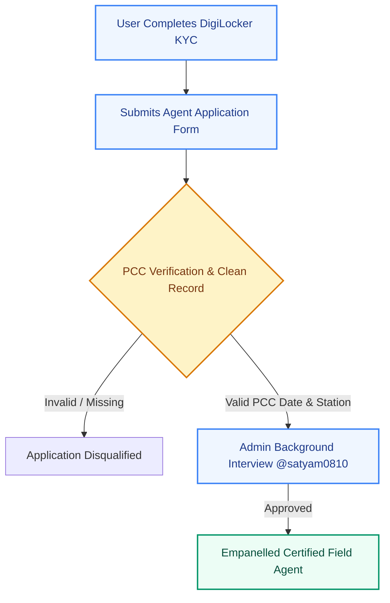
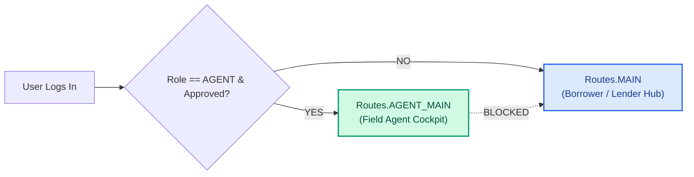
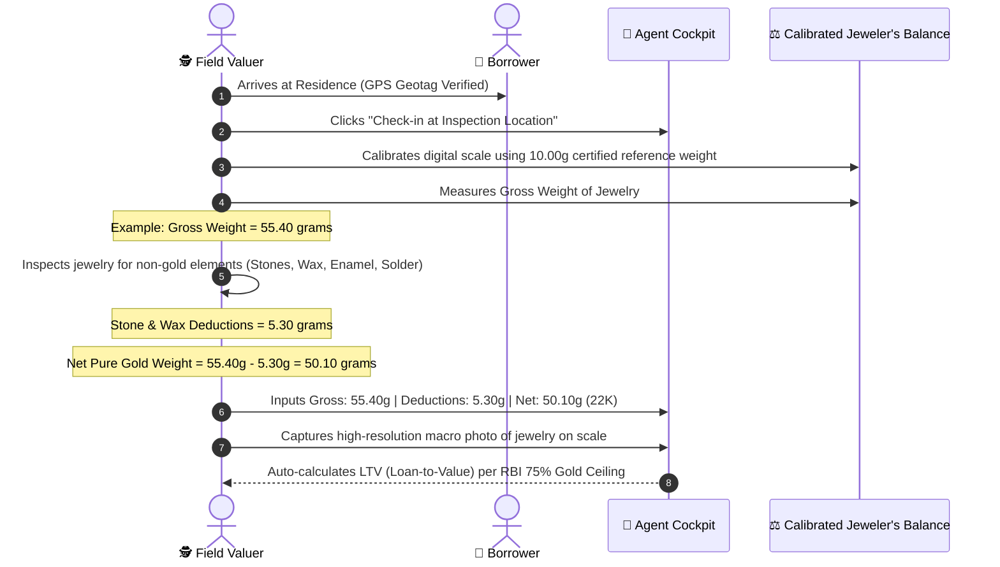
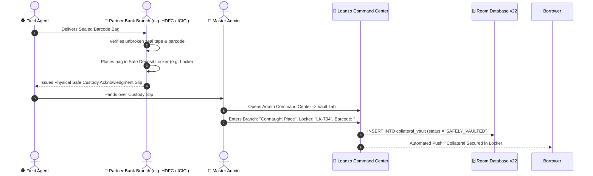
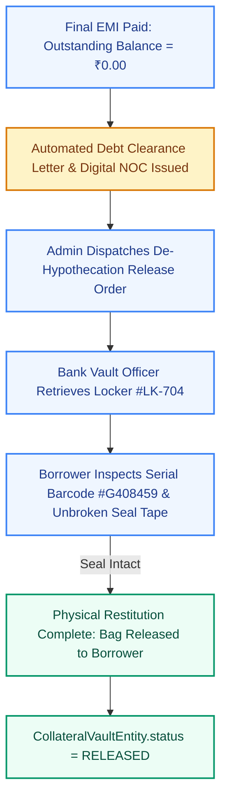

# 🕵️ Field Agent Standard Operating Procedure (SOP) & Institutional Vault Custody

<div align="center">

### **Doorstep Physical Verification, Gold Assaying & Custodial Protocol**
*Standard Operating Procedure (SOP) governing Certified Field Valuers, doorstep asset appraisal, tamper-evident barcode sealing, bank safe deposit custody, and de-hypothecation.*

---

[](../app/src/main/java/com/loanzo/app/ui/navigation/NavGraph.kt)
[](../app/src/main/java/com/loanzo/app/ui/agent/AgentVisitInspectionScreen.kt)
[](../app/src/main/java/com/loanzo/app/ui/admin/VaultTab.kt)
[](../app/src/main/java/com/loanzo/app/data/entity/CollateralVaultEntity.kt)

</div>

---

## 📑 Table of Contents
1. [Empanelment & Police Clearance Verification (PCC)](#1-empanelment--police-clearance-verification-pcc)
2. [Strict Role Isolation Gate (`Routes.AGENT_MAIN`)](#2-strict-role-isolation-gate-routesagent_main)
3. [Field Cockpit Architecture & Compensation Engine](#3-field-cockpit-architecture--compensation-engine)
4. [Doorstep Precious Metals Assaying Protocol](#4-doorstep-precious-metals-assaying-protocol)
5. [Tamper-Evident Bagging & Dual-Signature Sealing](#5-tamper-evident-bagging--dual-signature-sealing)
6. [Institutional Bank Vault Custody & CERSAI Lien](#6-institutional-bank-vault-custody--cersai-lien)
7. [Loan Settlement & De-Hypothecation Restitution Protocol](#7-loan-settlement--de-hypothecation-restitution-protocol)

---

## 1. Empanelment & Police Clearance Verification (PCC)

To guarantee counterparty trust and eliminate insider fraud, all Loanzo Field Agents undergo a rigorous multi-factor accreditation process before receiving physical inspection dispatch privileges.



### Empanelment Application Parameters (`AgentApplicationEntity`):
1. **Police Clearance Certificate (PCC)**: Mandatory submission of verified PCC issue date and jurisdictional Police Station name.
2. **Operational Radius**: Configurable operating territory between **5 km and 50 km** from the agent's verified home base.
3. **Transport & Driving License**: Verified commercial or private vehicle license (Motorcycle, Scooter, Car) enabling reliable mobility.
4. **Clean Record Declaration**: Formal statutory declaration affirming no pending criminal charges, financial default proceedings, or moral turpitude investigations under the **Indian Penal Code (IPC)** / **Bharatiya Nyaya Sanhita (BNS)**.

---

## 2. Strict Role Isolation Gate (`Routes.AGENT_MAIN`)

To prevent conflicts of interest (e.g., an agent undervaluing a borrower's jewelry to purchase it personally or bidding on loans they inspected), Loanzo enforces **Strict Architectural Role Isolation**:

```kotlin
// NavGraph.kt Architectural Enforcement
val startDestination = when {
    user.role == "AGENT" && user.agentApproved -> Routes.AGENT_MAIN
    user.role == "ADMIN" -> Routes.ADMIN_HUB
    else -> Routes.MAIN
}
```



When an approved agent logs in, they are redirected away from consumer tabs (`Loans`, `Marketplace`, `Bidding`). They operate exclusively within the **Field Agent Cockpit** (`Routes.AGENT_MAIN`).

---

## 3. Field Cockpit Architecture & Compensation Engine

The Field Agent Cockpit (`AgentDashboardScreen.kt`) provides real-time operational telemetry:

| Feature | Operational Mechanism |
| :--- | :--- |
| **Duty Toggle** | One-tap switch toggling between `ON_DUTY` (available for dispatch) and `ON_BREAK`. |
| **Earnings Meter** | Real-time accumulator tracking daily and cumulative payouts (`UserEntity.totalAgentEarnings`). |
| **Dispatch Feed** | Live queue of assigned visits categorized by priority and distance (`COLLATERAL_VERIFICATION`, `BORROWER_RESIDENCE`, `LENDER_AUDIT`). |
| **1-Tap Navigation** | Deep-links directly to Google Maps / Apple Maps using counterparty geotag coordinates (`addressGeotag`). |
| **Communication Hub** | Native intent launchers for verified phone calls and encrypted WhatsApp business channels. |

### Compensation Structure:
- **Residential Verification Visit**: ₹500 fixed payout.
- **Precious Metals Assaying Visit**: ₹750 – ₹1,200 depending on gross weight and travel distance.
- **Urgent Commercial Escrow Inspection**: ₹1,500 priority rate.

Payouts are automatically credited to the agent's ledger immediately upon administrative submission and photo proof validation.

---

## 4. Doorstep Precious Metals Assaying Protocol

During gold-backed micro-loan origination, the Certified Valuer conducts physical doorstep testing following strict Reserve Bank of India assaying directives:



### Mandatory Deductions Invariant:
Per **RBI Master Direction DNBR.PD.008/03.10.119/2016-17**, loan-to-value calculations must be based **strictly on the net weight of gold content**. The weight of precious stones, lacquer, thread, or solder must be deducted completely before appraisal.

---

## 5. Tamper-Evident Bagging & Dual-Signature Sealing

To eliminate substitution allegations (e.g., *"The lender returned fake gold"*), physical items are sealed at the borrower's residence inside tamper-evident serialized packaging:

```
┌────────────────────────────────────────────────────────┐
│  🔒 LOANZO INSTITUTIONAL VAULT ESCROW SECURITY BAG     │
│  BARCODE SERIAL: #G408459                              │
│                                                        │
│  Asset: 22K Gold Ornament (50.10g Net)                │
│  Loan ID: LN-92841029                                  │
│  Sealed Date: 12-Sep-2026 11:30 AM IST                 │
│                                                        │
│  [TAMPER-EVIDENT ADHESIVE VOID TAPE]                   │
│  WARNING: VOID PATTERN APPEARS IF PEELED               │
│                                                        │
│  Borrower Signature: ____________  Date: ____________  │
│  Agent Signature:    ____________  Date: ____________  │
└────────────────────────────────────────────────────────┘
```

1. **Serialized Tracking**: Each bag features an indelible, pre-printed barcode (e.g., `#G408459`).
2. **Void Tape Chemistry**: The opening seam uses high-security VOID adhesive that permanently leaves a red checkered "VOID OPENED" pattern if peeled or exposed to heat/freezing.
3. **Dual Signature Cross-Seal**: The borrower and field agent sign indelible permanent marker signatures directly across the boundary line of the seal tape and the plastic bag.
4. **Photographic Record**: The agent takes an on-screen photo of the sealed bag showing both signatures and the clear barcode serial number.

---

## 6. Institutional Bank Vault Custody & CERSAI Lien

The field agent never holds collateral overnight. Collateral must be deposited into a partner institutional safe deposit vault within 4 hours of collection.



### CERSAI Registration:
For loans exceeding ₹1,00,000, the security interest is electronically registered with the **Central Registry of Securitisation Asset Reconstruction and Security Interest (CERSAI)**, preventing the borrower from hypothecating the same asset across multiple financial institutions.

---

## 7. Loan Settlement & De-Hypothecation Restitution Protocol

When a borrower pays their final EMI and reduces the outstanding loan balance to exactly **₹0.00**, the de-hypothecation workflow is triggered automatically:



### Physical Handover Invariants:
1. **Unbroken Seal Audit**: The borrower must personally examine the seal tape in the presence of the vault officer to verify that no tampering has occurred.
2. **Digital Handover OTP**: The vault officer triggers a 6-digit handover OTP dispatched to the borrower's registered phone, entering it into the app to record physical release.
3. **Zero Storage Fees**: In compliance with consumer protection norms, no post-settlement holding fees or custodial penalties are levied against the borrower for prompt collections.

---

<div align="center">
<b>Loanzo Custodial Operations</b> • Certified Field Agent SOP Specification
</div>
