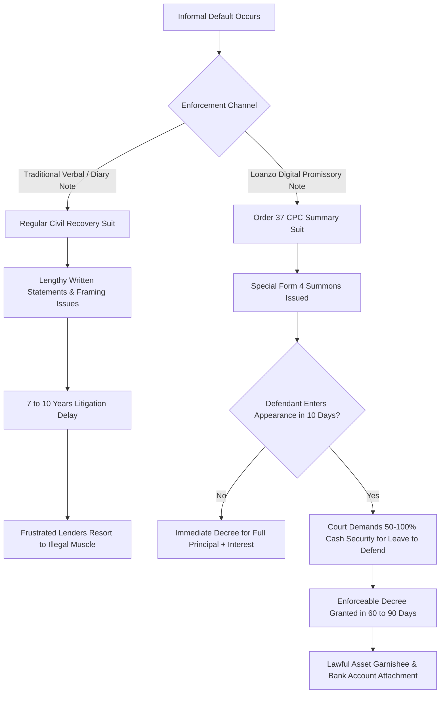

# Loanzo Protocol: Legal & Regulatory Compliance Whitepaper
**Document ID:** `LZ-LGL-WHP-2026-V3`  
**Classification:** Statutory Legal Whitepaper, Regulatory Compliance Defense, and Court Enforceability Protocol  
**Jurisdiction:** Republic of India (Union of India & State Legislative Enactments)  
**Primary Statutes:** IT Act 2000, NI Act 1881, CPC 1908, BSA 2023 / Evidence Act 1872, RBI Master Directions, DPDP Act 2023, Income Tax Act 1961  
**Associated Publication:** [LOANZO_LEGAL_AND_REGULATORY_COMPLIANCE_WHITEPAPER.pdf](file:///C:/AndroidProjects/loanzo/docs/LOANZO_LEGAL_AND_REGULATORY_COMPLIANCE_WHITEPAPER.pdf)

---

## 1. Executive Summary & Statutory Classification

In India, the informal credit ecosystem represents an estimated **$300+ Billion annual economy**. From rural agricultural clusters (farmers, weavers, dairy aggregators) to urban micro-enterprises and personal peer assistance, informal loans sustain millions who lack collateral or formal credit scores.

Historically, this vast market has operated in a destructive statutory failure:
1. **Lenders Suffer Judicial Paralysis**: Verbal assurances and handwritten diaries take **7 to 10 years** to litigate through Indian civil courts. Because civil recovery is slow, lenders frequently resort to illegal, strong-arm recovery agents.
2. **Borrowers Face Predatory Usury**: Without transparent ledger tracking, informal lenders charge compounding interest exceeding **60% to 120% per annum**, triggering debt spirals, extortion, and harassment.
3. **Rogue Digital Apps Exploit User Privacy**: Predatory lending applications harvest contacts, photos, and SMS messages, weaponizing private data for extortion.

### Legal Definition of Loanzo
> **Loanzo is NOT:**
> - A deposit-taking bank or banking institution.
> - A fund-pooling payment aggregator or escrow custodian.
> - An unlicensed commercial money-lending syndicate.
>
> **Loanzo IS:**
> - A **Non-Custodial Legal Engineering Protocol & Enterprise SaaS**.
> - An electronic contract synthesis engine operating under **Section 10A of the Information Technology Act, 2000**.
> - A statutory promissory note generator under **Section 4 of the Negotiable Instruments Act, 1881**.
> - A cryptographic audit provider fulfilling **Section 63 of Bharatiya Sakshya Adhiniyam, 2023** (formerly Section 65B of Indian Evidence Act, 1872).

---

## 2. Statutory Pillar I: Laws That SUPPORT Loanzo

Loanzo's architecture is grounded on seven federal statutory pillars:

### 2.1. Information Technology Act, 2000 (IT Act)
- **Section 10A (Validity of contracts formed through electronic means)**: Enacts that contracts negotiated, formed, and accepted electronically are legally binding and cannot be contested solely because they exist in digital format.
- **Sections 43A & 72A (Reasonable Security Practices)**: Compliance achieved via Android StrongBox Keystore encryption and SQLCipher AES-256 local encrypted storage.

### 2.2. Negotiable Instruments Act, 1881 (§4) & CPC Order XXXVII (Summary Suits)
- **Section 4 NI Act (Promissory Note)**: Defines an instrument in writing containing an unconditional undertaking signed by the maker to pay a certain sum of money only to, or to the order of, a certain person.
- **Order XXXVII (Order 37), Code of Civil Procedure 1908 (Summary Suits)**:
  - Debts arising on a Promissory Note qualify for an expedited **Summary Suit**.
  - The court presumes debt consideration.
  - The defendant debtor has no automatic right of defense; they must apply for *leave to defend* by depositing monetary security or demonstrating a bona fide triable defense.
  - Slashes court resolution time from **7–10 years to just 60–90 days**.

### 2.3. Bharatiya Sakshya Adhiniyam, 2023 (§63) / Evidence Act, 1872 (§65B)
- Provides statutory admissibility for electronic records.
- Loanzo's `EvidenceExportEngine` generates a legally compliant certificate capturing:
  1. SHA-256 document hash.
  2. Device Hardware UID and Android StrongBox Keystore signature.
  3. GPS geofence coordinate and timestamp.
  4. Bank UPI UTR transaction reference.

### 2.4. RBI Fair Lending Practices & Penal Charges Circular (RBI/2023-24/53)
- Explicitly mandates that penal interest must be reasonable, simple, and never compounded or added to capital.
- Loanzo's `PenaltyEngine` caps penal interest at **2% per annum simple interest** with a mandatory 3-day grace period.

### 2.5. Digital Personal Data Protection Act, 2023 (DPDP Act)
- Mandates purpose specification, data minimization, and explicit consent.
- Loanzo operates on an **offline-first model** (Room SQLite), requesting zero contact permissions, zero photo gallery access, and zero call-log snooping.

### 2.6. Indian Contract Act, 1872 (§10 & §124-147)
- Governs lawful mutual consent, consideration, and co-lender guarantee contracts.

---

## 3. Statutory Pillar II: Regulations That RESTRICT or STAND AGAINST the App

Fintech applications in India face stringent regulatory boundaries. Violating these directives results in criminal prosecution, RBI bans, or civil suit dismissals.

### 3.1. RBI NBFC-P2P Master Directions, 2017 (Updated August 2024)
- **The Restriction**: Operating a platform that matches retail strangers or takes customer funds requires a formal **NBFC-P2P License** from the RBI with a minimum **Net Owned Fund (NOF) of Rs. 20 Crores**.
- **Prohibitions**: Cannot hold customer money in proprietary accounts, cannot offer credit guarantees (FLDG), and cannot market instant-liquidity (T+0/T+1) funds.
- **Risk to Loanzo**: If Loanzo operated a central escrow or custodial fund pool, it would commit an immediate criminal offense under Section 45-IA of the RBI Act.

### 3.2. State Money Lenders Acts (Usury & Licensing Bars)
- **The Restriction**: State statutes (e.g., Punjab, Maharashtra, Karnataka, Tamil Nadu) declare that anyone in the "business of money lending" without a license cannot recover loans in civil court.
- **Consequence**: Under **Section 3 of state money lending acts**, courts dismiss suits filed by unlicensed commercial moneylenders outright. Interest rates above state caps (12–18%) constitute punishable crimes.

### 3.3. RBI Digital Lending Guidelines (DLG), 2022
- **The Restriction**: Mandates that loan disbursements and repayments must occur strictly between the bank accounts of the lender and borrower without passing through any third-party pool or intermediate digital wallet.
- Prohibits accessing mobile phone resources (contacts, call logs, media gallery).

### 3.4. Income Tax Act, 1961 — Sections 269SS & 269T (Cash Bans)
- **The Restriction**: Accepting or repaying loans of **Rs. 20,000 or more in cash** is strictly illegal.
- **Penalty**: Sections 271D and 271E impose a **100% tax penalty** equal to the entire loan amount on both borrower and lender.

### 3.5. Bharatiya Nyaya Sanhita, 2023 (§351/352) / IPC (§503/506) (Criminal Intimidation)
- Debt collection harassment, abusive phone calls, threatening family members, or public debt-shaming are non-bailable criminal offenses.

---

## 4. Master Comparative Legal Matrix

| Statute / Legal Domain | Regulatory Challenge ("Against") | Statutory Support ("Support") | Loanzo Lawful Safeguard |
| :--- | :--- | :--- | :--- |
| **RBI NBFC-P2P Directions** | Requires Rs. 20 Cr NOF license if matching strangers or holding user deposits. | Exempts non-custodial software vendors that do not touch or pool capital. | **Zero-Pool Architecture**: 100% direct NPCI UPI A2A transfers. Loanzo holds Rs. 0 customer funds. |
| **State Money Lenders Acts** | Unlicensed commercial lenders have recovery suits dismissed under §3 of State Acts. | Protects casual/isolated personal loans between acquaintances (SC jurisprudence). | **Casual Loan Classification**: Auto-caps transaction frequency; enforces statutory state usury limits. |
| **IT Act 2000 (§10A)** | Verbal or unstructured smartphone chats are contested as inadmissible hearsay. | Expressly validates contracts formed via electronic means with digital offer/acceptance. | **Structured Contract Engine**: Generates bilateral signed agreements with explicit mutual assent. |
| **NI Act 1881 (§4) & CPC Order 37** | Standard recovery suits take 7-10 years, paralyzing informal lenders. | Section 4 Promissory Notes qualify for fast-track 60-day Summary Suits under Order 37. | **Promissory Note Synthesis**: Every loan generates an unconditional §4 note with biometric proof. |
| **BSA 2023 (§63) / Evidence Act (§65B)** | Electronic evidence is rejected in court without a compliant hardware certificate. | Statutory admissibility of electronic records backed by certified hash & device UID. | **EvidenceExportEngine**: One-tap export of court-ready §65B certificate with SHA-256 hash. |
| **Income Tax Act (§269SS & 269T)** | 100% tax penalty on cash loan disbursement or repayment of Rs. 20,000 or more. | Digital banking and account-payee transfers provide total immunity from cash penalties. | **Mandatory UPI/Banking Trail**: Automated UTR logging and Rs. 1 penny-drop name matching. |
| **RBI DLG 2022 & DPDP Act 2023** | Ban on pass-through accounts and scraping of contacts, media, or call logs. | Endorses privacy-by-design, data minimization, and explicit consent architecture. | **Privacy-by-Design**: Zero contact/media access; offline-first encrypted Room SQLite storage. |
| **BNS 2023 (§351) / IPC (§506)** | Harassment, threats, and illegal recovery muscle lead to criminal arrest of lenders. | Statutory protection of borrower dignity and criminal prohibition of coercion. | **Telegram SOS Webhook**: Instant geofenced alert of unauthorized visits; automatic interest forfeiture. |

---

## 5. How Loanzo's Unique Process Lawfully Favours Users

### 1. Non-Custodial Direct UPI Rails
- Loanzo utilizes deep-linked NPCI UPI Intent calls (`upi://pay?...`).
- Funds move directly **Bank Account to Bank Account (A2A)**.
- **Favour to Lenders**: Capital is never locked in a third-party app wallet.
- **Favour to Borrowers**: Protected against unrecorded platform deductions and ghost fee skimming.

### 2. Casual Lending Safe Harbor
- Indian Supreme Court precedent (*G. Pankajakshi Amma v. Mathai Mathew [2004]*): *“An isolated or casual transaction of lending money to an acquaintance does not constitute carrying on the business of money lending.”*
- Loanzo auto-categorizes casual loans vs. licensed commercial loans, ensuring peer lenders do not lose legal standing in court.

### 3. Cryptographic StrongBox Biometric Signatures
- Uses Android StrongBox Keymaster (`PURPOSE_SIGN`).
- Private keys are stored in a dedicated tamper-resistant hardware element on the smartphone.
- Biometric authentication generates an unforgeable digital signature attached to the agreement hash, preventing debtors from denying execution.

### 4. Mathematical Penalty Ceiling (`PenaltyEngine`)
- Strictly adheres to RBI Circular `RBI/2023-24/53`.
- Simple 2% p.a. late fee, 3-day mandatory grace period, and strictly **zero compound interest**.
- Protects borrowers from predatory debt spirals.

### 5. Telegram SOS Webhook (Anti-Harassment Shield)
- One-tap emergency incident logging captures GPS coordinates, timestamp, and active loan details.
- Automatically notifies the lending syndicate of criminal intimidation liabilities under **BNS Sections 351/352 (IPC 503/506)**.
- Triggers automatic interest forfeiture under platform contract terms.

---

## 6. Standard Operating Procedure: Enforcing Loanzo Evidence in Court

1. **Step 1: Statutory Default Notice (7 Days)**:
   Advocate issues a formal legal demand notice referencing the Section 4 Promissory Note and the specific bank UPI UTR number.
2. **Step 2: Filing Summary Suit under Order XXXVII CPC**:
   Plaint filed in Civil Court invoking Order 37 Rule 1 & 2 CPC on negotiable instruments.
3. **Step 3: Submitting Bharatiya Sakshya Adhiniyam (§63) Certificate**:
   Advocate annexes the Loanzo-generated cryptographic electronic evidence certificate (SHA-256 hash, Device UID, StrongBox signature).
4. **Step 4: Special Form 4 Summons Service**:
   Court serves summons; debtor has 10 days to enter appearance.
5. **Step 5: Conditional Leave to Defend / Summary Judgment**:
   Debtor must deposit cash security to defend. Without a genuine triable defense, court issues executable recovery decree in **60 to 90 days**.
6. **Step 6: Execution of Decree under Order XXI CPC**:
   Attachment of debtor bank accounts and garnishee execution.

---

## 7. Institutional Roadmap & NeSL Integration

- **NeSL Digital Document Execution (DDE)**: Future automated integration with Union Information Utility (NeSL) for online revenue stamp duty payment (e-Stamping).
- **RBI Account Aggregator (AA)**: Onboarding as Financial Information User (FIU) for tamper-proof bank statement verification.
- **CERSAI Asset Registry**: Centralized collateral registration for agricultural and MSME asset-backed loans.

---

*This document is maintained as part of the official legal and engineering documentation for Loanzo.*
