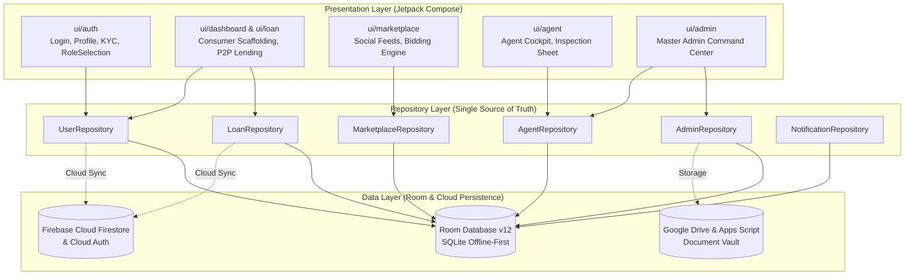

# Project Structure & Architecture Breakdown

Loanzo is structured according to **Clean Architecture** and **Unidirectional Data Flow (UDF)** with **Jetpack Compose**. The project enforces clean layer separation, offline-first resilience via Room, cloud sync via Firebase Firestore, and multi-role segregation between standard consumers, certified field agents, and the App Owner.

---

## 1. High-Level Component Topology



---

## 2. Detailed Directory Tree

```text
com.loanzo.app
├── data/                               # Data & Persistence Layer
│   ├── entity/                         # Room & Firestore Data Models
│   │   ├── UserEntity.kt               # Account credentials, KYC status, agentStatus, role, duty
│   │   ├── LoanEntity.kt               # Loan terms, balances, status, counterparty IDs
│   │   ├── RepaymentEntity.kt          # Installment dates, amounts, penalties, settlement status
│   │   ├── PledgeEntity.kt             # Collateral metadata, gold net weight, valuation, vault status
│   │   ├── NotificationEntity.kt       # In-app alerts, deadline triggers, deduplication keys
│   │   ├── MarketplacePostEntity.kt    # Public community loan pitches and capital pools
│   │   ├── MarketplaceBidEntity.kt     # Competitive bids and terms submitted on posts
│   │   ├── AgentApplicationEntity.kt   # Bank-grade field agent empanelment, experience, PCC
│   │   ├── AgentVisitEntity.kt         # Physical inspection visits, counterparty contacts, GPS
│   │   ├── CollateralVaultEntity.kt    # Institutional bank vault inventory, lockers, barcode bags
│   │   ├── ComplaintEntity.kt          # Grievances, disputes, priority tiers, arbitration state
│   │   ├── MediationMeetingEntity.kt   # Scheduled dispute hearings, video conference links
│   │   └── NocCertificateEntity.kt     # Cryptographic SHA-256 No Objection Certificates
│   │
│   ├── dao/                            # Room Data Access Objects
│   │   ├── UserDao.kt                  # User profiles, auth lookup, role updates
│   │   ├── LoanDao.kt                  # Reactive Flow queries for lent/borrowed portfolios
│   │   ├── RepaymentDao.kt             # Installment amortization schedules and penalties
│   │   ├── NotificationDao.kt          # In-app notifications and unread badges
│   │   ├── MarketplaceDao.kt           # Community post feeds and bids
│   │   ├── AgentDao.kt                 # Agent applications, status filters, scheduled visits
│   │   └── AdminDaos.kt                # CollateralVaultDao, ComplaintDao, MediationMeetingDao, NocCertificateDao
│   │
│   ├── repository/                     # Offline-First Repositories (SSOT)
│   │   ├── UserRepository.kt           # Local/cloud user state, biometrics, KYC binding
│   │   ├── LoanRepository.kt           # Loan lifecycle, eSign binding, repayments, UPI
│   │   ├── NotificationRepository.kt   # Daily scan engine, deadline triggers, deduplication
│   │   ├── MarketplaceRepository.kt    # Social loan marketplace feeds, bids, conversions
│   │   ├── AgentRepository.kt          # Empanelment submissions, duty switch, inspection logging
│   │   └── AdminRepository.kt          # 8-console command center: dispatch, vaulting, NOCs, mediation
│   │
│   ├── firebase/                       # Cloud Firestore, Storage, & Auth wrappers
│   ├── drive/                          # Google Drive API integrations via Google Apps Script proxy
│   ├── digilocker/                     # DigiLocker Indian Government KYC verification services
│   └── LoanzoDatabase.kt               # Room database configuration (Schema Version 12)
│
├── ui/                                 # Presentation Layer (Jetpack Compose UI & ViewModels)
│   ├── auth/                           # Authentication & Onboarding
│   │   ├── ProfileScreen.kt            # Revolut-style drill-down tiles, encrypted KYC vault
│   │   ├── KycScreen.kt                # Aadhaar/PAN upload, DigiLocker, CameraX liveness
│   │   ├── RoleSelectionScreen.kt      # Post-KYC selector: Normal Member vs Certified Field Agent
│   │   └── AuthViewModel.kt            # Authentication, session state, biometrics
│   │
│   ├── agent/                          # Dedicated Certified Field Agent Module
│   │   ├── AgentDashboardScreen.kt     # High-tactical cockpit, on/off-duty switch, earnings, visits feed
│   │   ├── AgentApplicationScreen.kt   # 4-step bank-grade empanelment application form
│   │   ├── AgentPendingApprovalScreen.kt# 4-stage application review timeline tracker
│   │   └── AgentInspectionSheet.kt     # Geotag check-in, asset appraisal, live photo capture
│   │
│   ├── admin/                          # Master Admin Command Center (Restricted to App Owner)
│   │   ├── AppOwnerVerificationScreen.kt# Institutional command console (8 tabs & real-time KPI ribbon)
│   │   ├── AssignVaultLockerDialog.kt  # Locker allocation, tamper-evident barcode sealing
│   │   ├── DispatchAgentSheet.kt       # Proximity-based loan-to-agent dispatch modal
│   │   ├── DocumentInspectionDialog.kt # Deep document audit, deficiency notices, tamper verification
│   │   └── ScheduleMediationDialog.kt  # Virtual arbitration scheduling with Google Meet links
│   │
│   ├── dashboard/                      # Unified Consumer Dashboard
│   │   ├── DashboardScreens.kt         # Portfolio overview, loan cards, quick origination
│   │   ├── DashboardViewModel.kt       # Financial health calculations, aggregate balances
│   │   ├── FinancialHealthScreen.kt    # 180° speedometer credit gauge, category donut charts
│   │   └── HomeActionSheets.kt         # Quick chat sheet, report action, EMI simulator
│   │
│   ├── loan/                           # Loan Lifecycle & Contracts
│   │   ├── LoanScreens.kt              # Lent/Borrowed segmented feeds, loan cards
│   │   ├── CreateLoanScreen.kt         # Smart picker, dual origination (Grant vs Request)
│   │   ├── LoanDetailScreen.kt         # Amortization, UPI disburse, prepayment calculator
│   │   ├── AgreementSigningScreen.kt   # 3-factor eSign (canvas, selfie, biometric)
│   │   └── ChatScreen.kt               # Real-time counterparty chat
│   │
│   ├── marketplace/                    # Social Loan Marketplace
│   │   ├── MarketplaceFeedScreen.kt    # Public community timeline, search, category chips
│   │   ├── CreateMarketplacePostScreen.kt# Post creation (Lend Offer vs Seek Loan)
│   │   └── PostDetailAndBidsSheet.kt   # Lenme-style bidding comparison & conversion
│   │
│   ├── notification/                   # Alerts & Notification Center
│   │   ├── NotificationScreen.kt       # Chronological grouping, search, urgent action hero
│   │   └── NotificationViewModel.kt    # Reactive notification state & filtering
│   │
│   ├── navigation/                     # Navigation & Scaffolding
│   │   ├── NavGraph.kt                 # Central routing, role isolation enforcement
│   │   ├── Routes.kt                   # Route definitions & parameter keys
│   │   └── BottomNavigationBar.kt      # Floating curved nav bar, docked plus FAB & radial menu
│   │
│   ├── components/                     # Reusable High-Tactical UI Components
│   │   ├── SegmentedCapsuleTab.kt      # Pill-shaped animated tab switcher
│   │   ├── SwipeToConfirmButton.kt     # Cred/Jupiter-inspired slider button
│   │   ├── PrepaymentSimulatorSheet.kt # "What If I Prepay?" savings calculator
│   │   └── UpiQrCodeDialog.kt          # Dynamic UPI QR scan-to-pay dialog
│   │
│   └── theme/                          # Theming & Visual Aesthetics
│       ├── Color.kt                    # Obsidian cyberpunk palette (Navy900, Emerald, Gold, Cyan)
│       ├── Theme.kt                    # Material 3 dark/light dynamic theme setup
│       └── Type.kt                     # Typography & font styling
│
├── domain/                             # Pure Business Logic
│   ├── PenaltyEngine.kt                # Compound/Simple/Flat late penalty math with RBI caps
│   └── RuleEngine.kt                   # Automated disbursal rules and underwriting checks
│
├── util/                               # Utility Engines & Helpers
│   ├── AgreementGenerator.kt           # On-device legal contract & NOC PDF generator
│   ├── TelegramManager.kt              # 24/7 Telegram bot assistant (@Loanzo_bot) & alerts
│   ├── TranslationHelper.kt            # Google GTX 11-language translation engine + LRU cache
│   ├── BiometricAuthManager.kt         # Biometric prompt & password-verified enrollment
│   └── CompositionLocals.kt            # Scoped DI bindings for repositories & navigation
│
└── LoanzoApplication.kt                # Application entrypoint & Hilt dependency setup
```
