# 🏛️ LOANZO: Master Engineering Whitepaper & Technical Architecture Specification

### **Next-Generation Decentralized Peer-to-Peer (P2P) Micro-Credit & Social Lending Protocol**
*Engineered for Mathematical Rigor, Bank-Grade Cryptography, Statutory Compliance, and Zero-Fraud Financial Inclusion.*

---

---

## 📋 Document Control & Metadata

| Specification Attribute | Value |
| :--- | :--- |
| **System Name** | **Loanzo Peer-to-Peer Social Lending Platform** |
| **Document Classification** | Master Engineering Whitepaper & Technical Architecture Specification |
| **Release Target** | Version 2.4.0 (Production Release / Build 24) |
| **Target Operating Environment** | Android 8.0 (API Level 26) through Android 14 / 15 (API Level 34 / 35) |
| **Primary Architecture Pattern** | MVI / MVVM Clean Architecture with Reactive Coroutine StateFlows |
| **Data Persistence Engine** | Offline-First Android Room v18 SQLite + Encrypted KeyStore Document Vault |
| **Distributed Cloud Sync** | Node.js/Express Backend Proxy (Vercel) + Cloud Firestore + Google Drive REST API |
| **Multi-Model AI Infrastructure** | 3-Way Parallel Racing Engine (LLM7 + SambaNova + Cloudflare Workers AI) |
| **Statutory Jurisdiction** | Republic of India (RBI NBFC-P2P Guidelines, IT Act 2000, NI Act 1881, DPDPA 2023) |

---

## 📑 Comprehensive Table of Contents

1. [Executive Summary & Problem Domain](#1-executive-summary--problem-domain)
2. [C4 Architectural Blueprint](#2-c4-architectural-blueprint)
   - 2.1 [System Context (Level 1)](#21-system-context-diagram-c4-level-1)
   - 2.2 [Container Architecture (Level 2)](#22-container-architecture-diagram-c4-level-2)
   - 2.3 [Component Breakdown (Level 3)](#23-component-breakdown-c4-level-3)
   - 2.4 [Runtime Execution Lifecycle (Level 4)](#24-runtime-execution-lifecycle-c4-level-4)
3. [Core Subsystem Specifications](#3-core-subsystem-specifications)
   - 3.1 [Identity, Biometric Session Gate & 3-Step KYC Engine](#31-identity-biometric-session-gate--3-step-kyc-engine)
   - 3.2 [Role-Based Access Control & Isolated Field Agent Cockpit](#32-role-based-access-control--isolated-field-agent-cockpit)
   - 3.3 [Dual-Track Loan Origination (Direct P2P vs Community Marketplace)](#33-dual-track-loan-origination-direct-p2p-vs-community-marketplace)
   - 3.4 [Multi-Model AI Race Engine & Account-Grounded RAG](#34-multi-model-ai-race-engine--account-grounded-rag)
   - 3.5 [Legal Contract Engine & Promissory Notes (Sec 4 NI Act)](#35-legal-contract-engine--promissory-notes-sec-4-ni-act)
   - 3.6 [Physical Collateral Assaying & Institutional Vault Escrow](#36-physical-collateral-assaying--institutional-vault-escrow)
   - 3.7 [Mathematical Amortization & Fair Lending Penalty Engine](#37-mathematical-amortization--fair-lending-penalty-engine)
   - 3.8 [Smart Mediation Desk & RBI Hardship Restructuring](#38-smart-mediation-desk--rbi-hardship-restructuring)
4. [Relational Data Layer & Room SQLite v18 Schema](#4-relational-data-layer--room-sqlite-v18-schema)
5. [Hardware Security, Cryptography & Threat Modeling](#5-hardware-security-cryptography--threat-modeling)
6. [Indian Financial Law & Regulatory Compliance Matrix](#6-indian-financial-law--regulatory-compliance-matrix)
7. [Sub-Documentation Directory & Index](#7-sub-documentation-directory--index)

---

## 1. Executive Summary & Problem Domain

### 1.1 The Indian Informal Micro-Credit Dilemma
India possesses a domestic informal lending economy exceeding **₹35 Lakh Crore (~$420B USD)**. The informal credit space—dominated by local money lenders, informal *chit funds*, and unorganized friend-and-family loans—suffers from systemic inefficiencies:

1. **Predatory Usury**: Unregulated lenders routinely levy annualized percentage rates (APRs) ranging from **36% to 120%**, exploiting vulnerable borrowers during medical and agricultural emergencies.
2. **Unenforceable Paperwork**: Informal transactions rely on verbal assurances or rudimentary paper chits that fail legal admissibility tests under the **Indian Evidence Act, 1872** and the **Negotiable Instruments Act, 1881**.
3. **Predatory Harassment vs. Total Default**: Lenders lack structured recovery mechanisms, resulting in either unlawful coercive recovery practices or catastrophic default rates exceeding 25%.
4. **Illegal Payday Lending Apps**: Rogue Chinese-origin lending applications deploy malware, harvest personal address books, and violate RBI digital lending norms, eroding consumer trust.

### 1.2 The Loanzo Protocol Solution
**Loanzo** is an architectural paradigm shift. It replaces predatory black-box apps with a transparent, decentralized, legally grounded, and mathematically bounded peer-to-peer credit infrastructure:

- **Mathematical Usury Caps**: The embedded `RuleEngine` strictly enforces state-by-state statutory interest ceilings (**9% to 18% p.a.**) under Indian Money Lenders Acts, making predatory compounding impossible.
- **Section 4 NI Act Promissory Notes**: Automated, native client-side rendering of multi-page legal promissory notes incorporating dual biometric signatures, front-camera liveness selfies, canvas signatures, and unique SHA-256 cryptographic audit hashes.
- **Purpose-Bound Milestone Escrow**: Capital can be released in conditional tranches directly to verified merchant/institution UPI IDs (e.g., hospitals, universities, raw material suppliers), eliminating fund diversion.
- **Physical Collateral Assaying & Bank Custody**: Doorstep precious metals assaying by certified field valuers using calibrated jeweler's scales, tamper-evident serialized barcode bags, and bank safe-deposit box custody.
- **Multi-Model AI Copilot**: Low-latency financial assistant powered by a parallel racing engine across three tier-1 LLM inference clusters (LLM7 Llama-3.3-70B, SambaNova, Cloudflare Workers AI) with account-grounded RAG context.

---

## 2. C4 Architectural Blueprint

### 2.1 System Context Diagram (C4 Level 1)

The following diagram illustrates how Loanzo connects human actors, hardware peripherals, and external financial and regulatory cloud infrastructures.

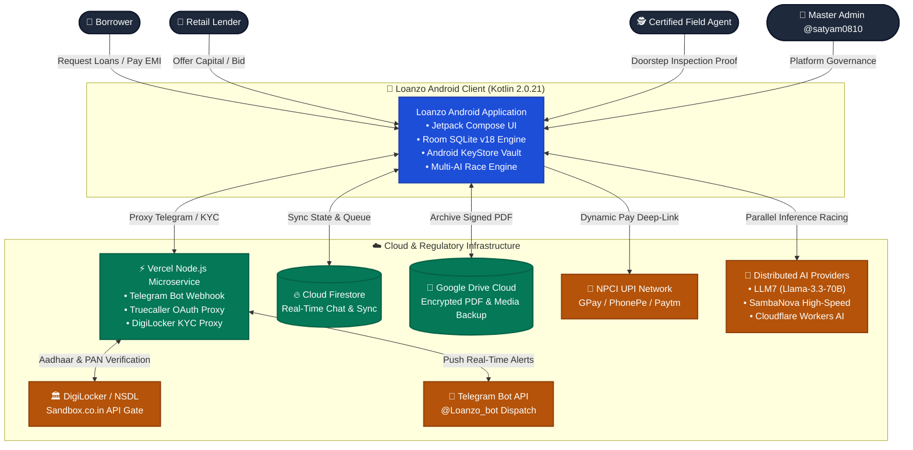

---

### 2.2 Container Architecture Diagram (C4 Level 2)

Inside the Loanzo Android client, the system maintains strict separation of concerns across presentation, domain, and data tiers.

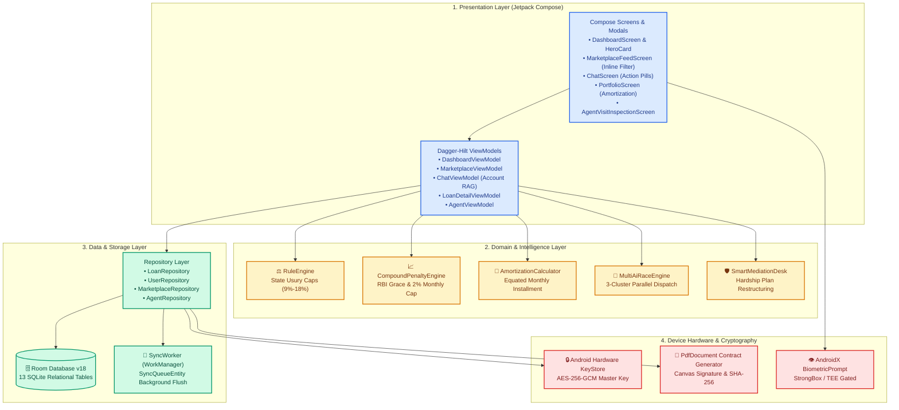

---

### 2.3 Component Breakdown (C4 Level 3)

The internal software components interact via reactive unidirectional data flow (UDF):

| Layer | Component Name | Source File | Key Invariant / Responsibility |
| :--- | :--- | :--- | :--- |
| **Presentation** | `MarketplaceFeedScreen` | `ui/screens/MarketplaceFeedScreen.kt` | Inline filter and search bar, 180° animated chevron dropdown, bouncy spring transitions. |
| **Presentation** | `ChatScreen` | `ui/screens/ChatScreen.kt` | Interactive AI action pills (`[🧮 Open Loan Calculator]`, `[🛡️ Complete KYC]`), suggestion chips. |
| **Presentation** | `PortfolioScreen` | `ui/screens/PortfolioScreen.kt` | Full-page smart portfolio analytics, active loan cards, and prepayment savings simulator. |
| **Domain** | `MultiAiRaceEngine` | `ai/MultiAiRaceEngine.kt` | First-token response racing across LLM7, SambaNova, Cloudflare with heuristic fallback. |
| **Domain** | `RuleEngine` | `domain/RuleEngine.kt` | Statutory interest rate ceilings (9%–18%), Sec 269SS/269T electronic disbursement gating. |
| **Domain** | `OfflineHeuristicProvider` | `ai/OfflineHeuristicProvider.kt` | 100% offline fallback financial advice with embedded navigation action triggers. |
| **Data** | `AppDatabase` (v18) | `data/local/AppDatabase.kt` | Room database schema defining 13 entity tables and transactional integrity. |
| **Security** | `BankingSessionManager` | `util/BankingSessionManager.kt` | 3-minute grace window, 5-minute screen-on idle lock, 48-hour hard credential invalidation. |
| **Contract** | `AgreementGenerator` | `util/AgreementGenerator.kt` | Native multi-page legal promissory note PDF generation with SHA-256 stamp. |

---

### 2.4 Runtime Execution Lifecycle (C4 Level 4)

#### Banking-Grade Cold Launch & Background Warmup Pipeline
To eliminate cold-start UI jank, white-screen flashes, and navigation routing jumps, Loanzo utilizes a coordinated 3.5-second cinematic splash window for asynchronous hardware audit and database pre-warming.

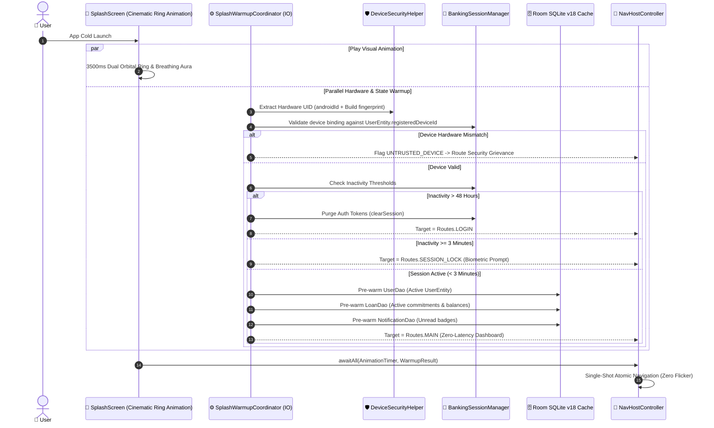

---

## 3. Core Subsystem Specifications

### 3.1 Identity, Biometric Session Gate & 3-Step KYC Engine

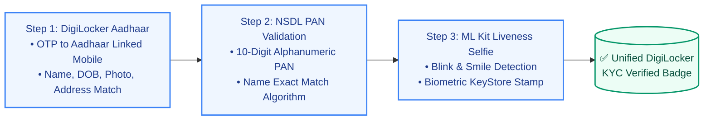

- **Aadhaar via DigiLocker**: Direct integration via Sandbox.co.in backend proxy, retrieving government-signed XML payloads containing verified legal name, date of birth, permanent address, and official photograph.
- **PAN Verification**: Real-time NSDL database lookup verifying the borrower's permanent account number, preventing synthetic identity fraud and loan stacking.
- **On-Device Face Liveness (ML Kit)**: Zero-cloud-transmission facial detection verifying real-time micro-movements (blinking, head yaw, smile) to prevent spoofing using static photographs or video replays.
- **Biometric Session Guard**: Inactivity greater than 180 seconds activates `SessionLockScreen`. The user unlocks instantly via `BiometricPrompt` (Class 3 Biometrics: Fingerprint or Face Unlock) with a 4-digit PIN fallback.

---

### 3.2 Role-Based Access Control & Isolated Field Agent Cockpit

Loanzo strictly isolates user personas to prevent conflicts of interest and maintain institutional auditability:

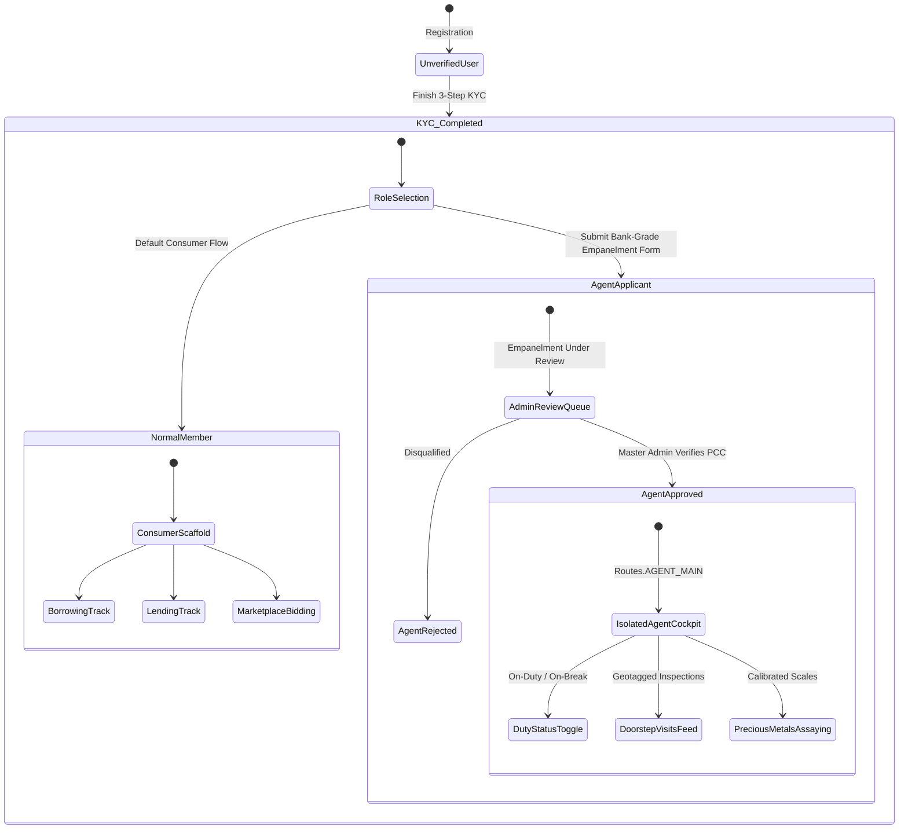

#### Strict Security Isolation Invariant
When a user with `role == "AGENT"` and `agentApproved == true` logs in, `NavGraph.kt` routes them exclusively to `Routes.AGENT_MAIN`. Field agents are cryptographically gated from consumer borrowing and lending feeds to eliminate insider manipulation of asset appraisals.

---

### 3.3 Dual-Track Loan Origination (Direct P2P vs Community Marketplace)

Loanzo provides two distinct pathways for capital formation:

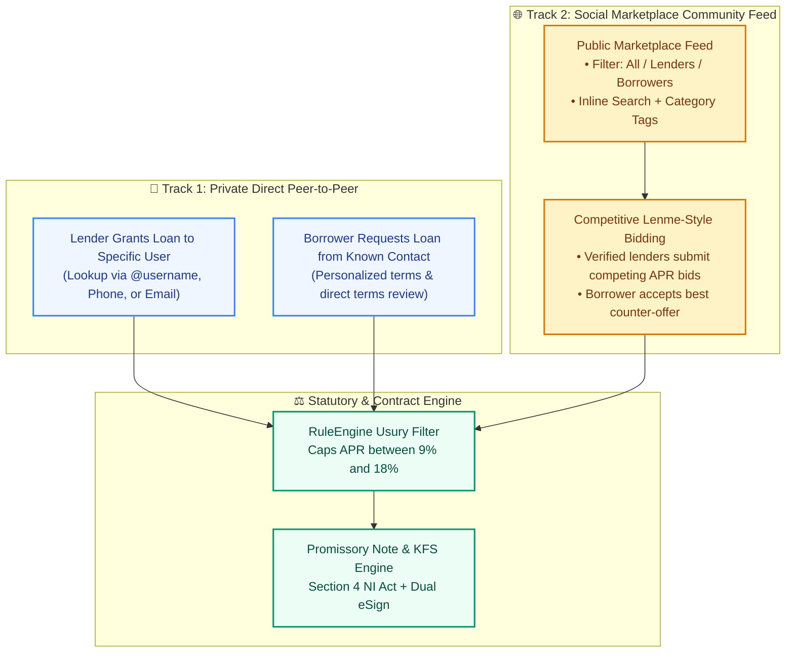

#### The Inline Marketplace Architecture
In `MarketplaceFeedScreen.kt`, the community feed features a streamlined 50dp horizontal header containing:
1. **Interactive Filter Pill**: Visualizes active filter (`All Offers`, `Lenders`, `Borrowers`, `My Posts`). Clicking triggers a 180° bouncy chevron flip animation (`animateFloatAsState` + `Spring.DampingRatioMediumBouncy`) opening a glassmorphic dropdown with active indicators.
2. **Inline Search TextField**: Weight-filling (`weight(1f)`) search input allowing real-time filtering across titles, descriptions, categories, and author names without layout shift.

---

### 3.4 Multi-Model AI Race Engine & Account-Grounded RAG

Loanzo implements an enterprise multi-model AI racing architecture that queries multiple high-throughput cloud inference endpoints concurrently:

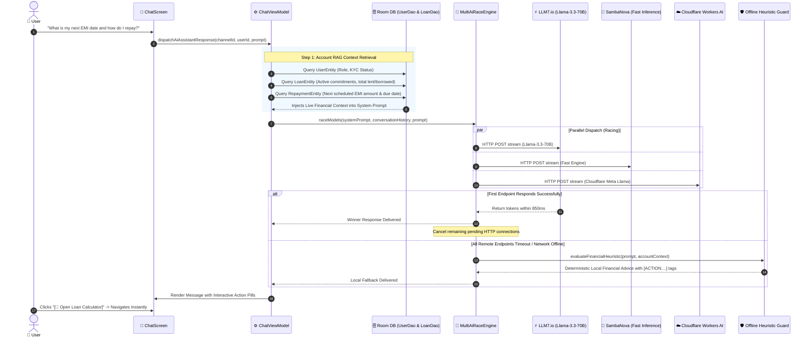

#### Interactive Action Pill Deep-Linking
When the AI assistant detects actionable financial intentions in user queries, it automatically appends deep-link action triggers that render as rich elevated button pills in the chat UI:

| Tag Pattern | Rendered Composable Pill | Destination Route | Trigger Criteria |
| :--- | :--- | :--- | :--- |
| `[ACTION:OPEN_CALCULATOR]` | `🧮 Open Loan Calculator` | `Routes.LOAN_CALCULATOR` | User asks about interest, EMI calculations, or repayment formulas. |
| `[ACTION:COMPLETE_KYC]` | `🛡️ Complete KYC Verification` | `Routes.KYC_STEP_1` | Unverified user inquires about loan eligibility or verification badges. |
| `[ACTION:EXPLORE_MARKETPLACE]` | `🛒 Explore Marketplace` | `Routes.COMMUNITY_MARKETPLACE` | User asks where to find loan offers or how to post a funding pitch. |
| `[ACTION:VIEW_PORTFOLIO]` | `📊 View Smart Portfolio` | `Routes.PORTFOLIO` | User asks about active loans, total debt, repayment schedule, or prepayments. |

---

### 3.5 Legal Contract Engine & Promissory Notes (Sec 4 NI Act)

Every loan agreed upon on Loanzo is backed by an on-device generated, legally binding **Promissory Note and Key Fact Statement (KFS)** complying with **Section 4 of the Negotiable Instruments Act, 1881** and **Section 10A of the Information Technology Act, 2000**.

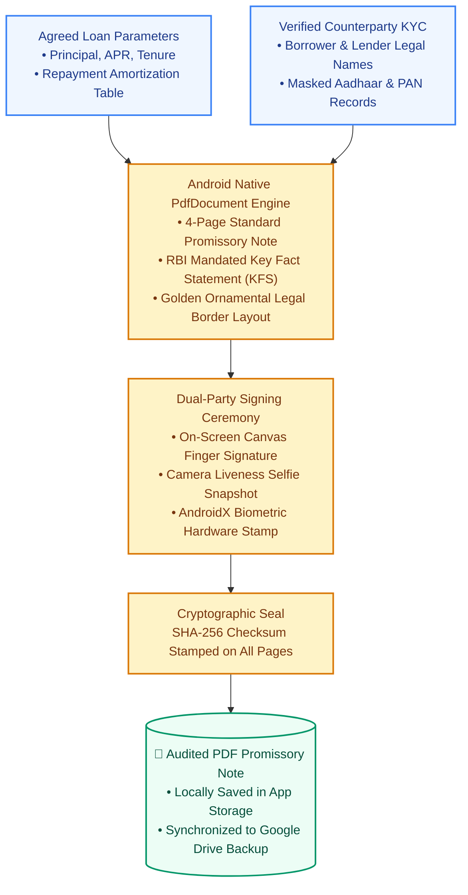

#### Key Legal Invariants in Contract Generation
1. **Unconditional Promise**: Explicit statutory clause: *"I, [Borrower Name], unconditionally promise to pay [Lender Name] or order, the sum of ₹[Amount] with interest at [Rate]% per annum..."*
2. **KFS Inclusion**: Mandated breakdown of Total Cost of Credit, Net Disbursed Amount, Annual Percentage Rate (APR), and Amortization Schedule per **RBI/2022-23/111**.
3. **Audit Trail**: Every page features an indelible footer stamping the Document UUID, Timestamp, Counterparty User IDs, and 64-character SHA-256 Digest.

---

### 3.6 Physical Collateral Assaying & Institutional Vault Escrow

For secured micro-loans, Loanzo provides an end-to-end custody and assaying pipeline:

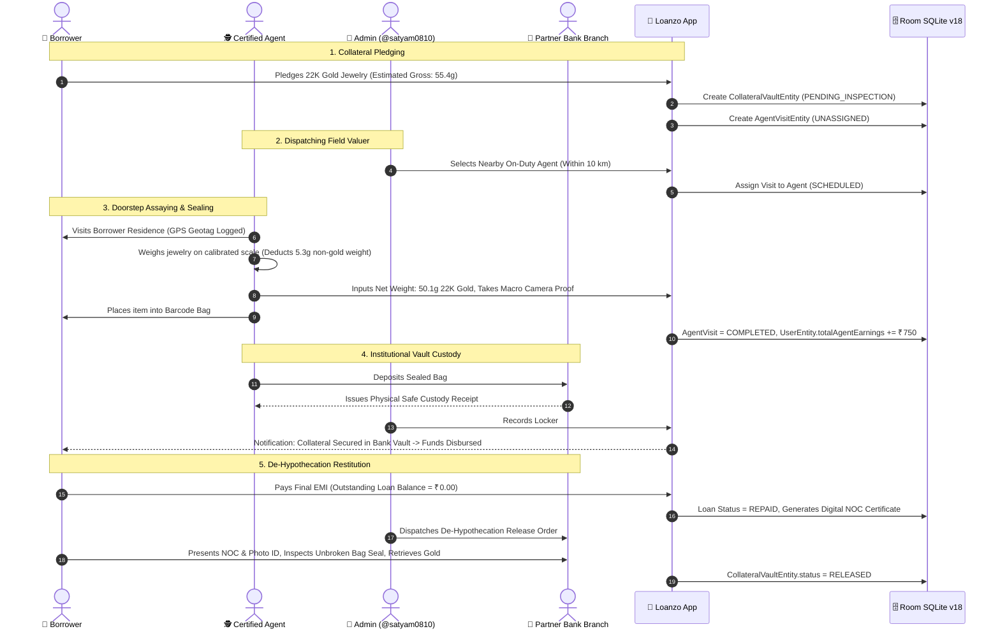

---

### 3.7 Mathematical Amortization & Fair Lending Penalty Engine

#### Equated Monthly Installment (EMI) Formula
Standard reducing balance amortization implemented in `AmortizationCalculator.kt`:

$$EMI = \frac{P \times r \times (1 + r)^n}{(1 + r)^n - 1}$$

Where:
- $P$ = Principal loan amount
- $r$ = Monthly interest rate ($\frac{\text{Annual Rate}}{12 \times 100}$)
- $n$ = Loan tenure in months

#### Fair Lending Compound Penalty Engine
In strict accordance with **RBI Circular RBI/2023-24/53 (Fair Lending Practices - Penal Charges in Loan Accounts)**:

$$\text{Daily Penal Charge} = \begin{cases} 
0 & \text{if } D_{\text{overdue}} \le 3 \text{ (Grace Period)} \\
\min\left(\frac{P_{\text{overdue}} \times 0.02}{30} \times (D_{\text{overdue}} - 3), \; P_{\text{overdue}} \times 0.02\right) & \text{if } D_{\text{overdue}} > 3 
\end{cases}$$

1. **3-Day Grace Period**: Zero penalty during the first 72 hours following the due date.
2. **No Capitalization**: Penal charges are never capitalized into the principal debt, preventing predatory compounding spirals.
3. **2% Monthly Ceiling**: Penal charges can never exceed 2.00% of the overdue installment for any monthly cycle.

---

### 3.8 Smart Mediation Desk & RBI Hardship Restructuring

When unexpected financial hardships occur (loss of employment, medical crises), Loanzo provides an automated alternative to adversarial litigation:

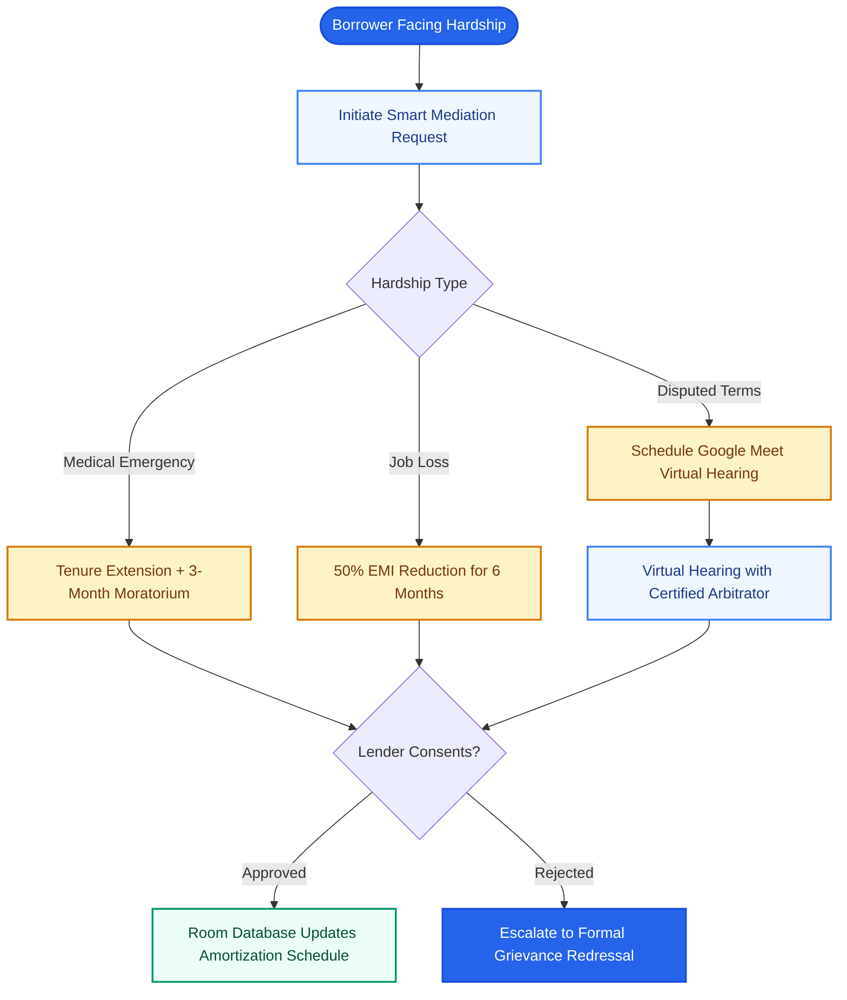

---

## 4. Relational Data Layer & Room SQLite v18 Schema

The Room Database (`data/local/AppDatabase.kt`) acts as the single offline-first source of truth for the entire client application, maintaining 13 relational entities:

| Table Name | Entity Class | Primary Key | Critical Attributes | Synchronized Remote Target |
| :--- | :--- | :--- | :--- | :--- |
| `users` | `UserEntity` | `userId: String` | `name`, `email`, `phone`, `role`, `kycStatus`, `aadhaarVerified`, `panVerified`, `trustScore`, `registeredDeviceId`, `telegramChatId`, `totalAgentEarnings` | Cloud Firestore (`users`) & Vercel |
| `loans` | `LoanEntity` | `loanId: String` | `lenderId`, `borrowerId`, `amount`, `interestRate`, `tenureMonths`, `purpose`, `status`, `repaidAmount`, `agreementPdfUrl`, `disbursementMethod`, `kfsHash` | Cloud Firestore (`loans`) |
| `repayments` | `RepaymentEntity` | `repaymentId: String` | `loanId`, `installmentNumber`, `dueDate`, `amountDue`, `paidAmount`, `status`, `paidDate`, `utrReference`, `penalCharges` | Cloud Firestore (`repayments`) |
| `marketplace_posts` | `MarketplacePostEntity` | `postId: String` | `authorId`, `postType` (`OFFER_TO_LEND`/`SEEKING_LOAN`), `title`, `minAmount`, `maxAmount`, `interestRate`, `tenureMonths`, `purposeCategory`, `vouchCount`, `status` | Cloud Firestore (`marketplace_posts`) |
| `marketplace_bids` | `MarketplaceBidEntity` | `bidId: String` | `postId`, `bidderId`, `bidderName`, `proposedAmount`, `proposedInterestRate`, `proposedTenureMonths`, `status` | Cloud Firestore (`marketplace_bids`) |
| `agent_applications` | `AgentApplicationEntity` | `applicationId: String` | `userId`, `pccDate`, `policeStation`, `operatingRadiusKm`, `transportType`, `drivingLicenseNumber`, `status` (`PENDING`/`APPROVED`) | Cloud Firestore (`agent_applications`) |
| `agent_visits` | `AgentVisitEntity` | `visitId: String` | `agentId`, `counterpartyName`, `visitType`, `addressGeotag`, `payoutAmount`, `status`, `notes`, `inspectionProofUrl` | Cloud Firestore (`agent_visits`) |
| `collateral_vault` | `CollateralVaultEntity` | `vaultId: String` | `loanId`, `borrowerId`, `assetType`, `grossWeightGrams`, `netWeightGrams`, `vaultBranchName`, `lockerNumber`, `barcodeSecurityTag`, `status` | Cloud Firestore (`collateral_vault`) |
| `complaints` | `ComplaintEntity` | `complaintId: String` | `complainantId`, `accusedId`, `loanId`, `category`, `priority`, `subject`, `resolutionMemo`, `status` | Cloud Firestore (`complaints`) |
| `mediation_meetings` | `MediationMeetingEntity` | `meetingId: String` | `complaintId`, `loanId`, `initiatorName`, `scheduledDate`, `timeSlot`, `meetingLink`, `agenda`, `status` | Cloud Firestore (`mediation_meetings`) |
| `noc_certificates` | `NocCertificateEntity` | `nocId: String` | `loanId`, `borrowerId`, `lenderId`, `totalAmountRepaid`, `loanSettledDate`, `digitalSignatureSha256`, `status` | Cloud Firestore (`noc_certificates`) & GDrive |
| `notifications` | `NotificationEntity` | `notificationId: String`| `userId`, `title`, `message`, `type`, `isRead`, `relatedLoanId`, `actionRoute`, `dayKey` | Local Only (Computed Engine) |
| `sync_queue` | `SyncQueueEntity` | `id: Long` (Auto-inc) | `tableTarget`, `entityId`, `payloadJson`, `operation` (`INSERT`/`UPDATE`/`DELETE`), `timestamp`, `retryCount` | In-Flight Memory Buffer |

---

## 5. Hardware Security, Cryptography & Threat Modeling

### 5.1 Hardware KeyStore & Encrypted Document Vault
User KYC credentials (unmasked Aadhaar numbers, PAN documents, bank passbook scans) are never stored in plain SQLite text.

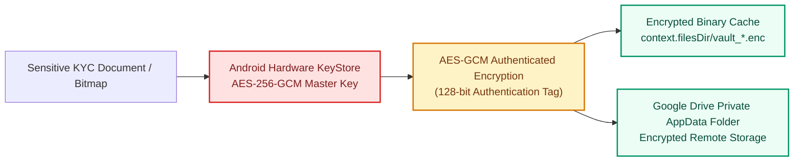

- **Hardware Backing**: Master keys are generated inside the device's **Trusted Execution Environment (TEE)** or **StrongBox Keymaster** hardware chip.
- **Biometric Binding**: Critical decrypt operations require user biometric authentication within an active cryptographic authorization window (`setUserAuthenticationRequired(true)`).

### 5.2 STRIDE Threat Model Analysis

| Threat Category | Potential Vector | Loanzo Countermeasure & Architectural Defense |
| :--- | :--- | :--- |
| **Spoofing Identity** | Attacker uses forged ID photos or synthetic PAN to register. | Mandatory DigiLocker OAuth XML signature validation + ML Kit on-device face liveness detection. |
| **Tampering with Data** | Borrower modifies local loan terms or balance in SQLite. | Dual-signed SHA-256 agreement hash verified against Firestore master audit ledger upon sync. |
| **Repudiation** | Borrower claims they never received funds or signed contract. | Biometric signature stamp, camera selfie snapshot embedded in PDF, and UTR payment receipt. |
| **Information Disclosure** | Shoulder surfing or unmonitored unlocked device access. | 3-minute inactivity session lock + 5-minute screen-on idle lock engaging `SessionLockScreen`. |
| **Denial of Service** | Rogue queries exhausting cloud AI assistant quotas. | 3-way racing engine with automatic graceful fallback to on-device deterministic heuristic engine. |
| **Elevation of Privilege** | Normal user accesses Field Agent or Master Admin console. | Strict role-based isolation gates (`Routes.AGENT_MAIN` and `@satyam0810` admin verification). |

---

## 6. Indian Financial Law & Regulatory Compliance Matrix

Loanzo is engineered specifically around the Indian statutory and regulatory framework:

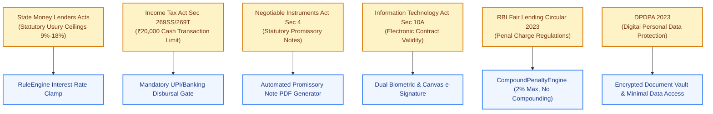

| Statutory Authority | Applicable Legislation / Rule | Compliance Enforcement in Code |
| :--- | :--- | :--- |
| **Reserve Bank of India (RBI)** | *Master Direction - Non-Banking Financial Company - Peer to Peer Lending Platform (Reserve Bank) Directions* | Key Fact Statement (KFS), cooling-off cancellation windows, direct lender-borrower fund flows. |
| **Reserve Bank of India (RBI)** | *Fair Lending Practices - Penal Charges in Loan Accounts (RBI/2023-24/53)* | 3-day grace period, daily simple penalty capped at 2% monthly maximum without capitalization. |
| **Department of Revenue, MoF** | *Section 269SS & Section 269T, Income Tax Act, 1961* | Any loan origination or repayment $\ge$ ₹20,000 forces account payee electronic banking (UPI/IMPS). |
| **Parliament of India** | *Section 4, Negotiable Instruments Act, 1881* | Auto-generated promissory notes contain unambiguous unconditional promises to pay with sum certainty. |
| **Ministry of Electronics & IT** | *Section 10A, Information Technology Act, 2000* | Electronic records and biometric signatures are legally valid and enforceable in courts of law. |
| **Data Protection Board of India** | *Digital Personal Data Protection Act (DPDPA), 2023* | Explicit consent mechanisms, purpose-bound KYC collection, zero third-party telemetry leakage. |
| **State Governments** | *State Money Lenders Acts (Bombay, Tamil Nadu, Karnataka)* | Hard APR bounds (secured: 9%–12%, unsecured: 15%–18%), preventing usurious debt traps. |

---

## 7. Sub-Documentation Directory & Index

For specialized deep dives, consult the dedicated sub-documents in this technical library:

| Document | File Path | Focus Area |
| :--- | :--- | :--- |
| **System Architecture Guide** | [SystemArchitecture.md](SystemArchitecture.md) | Architectural patterns, dependency injection, WorkManager sync, Telegram bot webhook. |
| **Database Schema & Migrations** | [Database_Schema_and_Migrations.md](Database_Schema_and_Migrations.md) | Room SQLite v22 engine, 23 entity tables, ER diagrams, indices, and Firestore sync. |
| **Security Architecture & Threat Model** | [Security_and_Cryptography.md](Security_and_Cryptography.md) | Hardware KeyStore (StrongBox/TEE), AES-256-GCM vault, BiometricPrompt, STRIDE threat model. |
| **API & Integration Specification** | [API_Specification.md](API_Specification.md) | Vercel backend endpoints, Telegram Bot Webhook, Sandbox.co.in DigiLocker proxy, UPI QR scheme. |
| **Field Agent SOP & Vault Custody** | [Field_Agent_SOP_and_Vault_Custody.md](Field_Agent_SOP_and_Vault_Custody.md) | Doorstep gold assaying, jeweler scale protocol, tamper-proof barcode bags, bank safe custody. |
| **System Flowcharts & Diagrams** | [Loanzo_System_Flowcharts.md](diagrams/Loanzo_System_Flowcharts.md) | Complete vector flowcharts for P2P lifecycle, AI racing, 3-step KYC, and field agent assaying. |
| **AI Copilot & Multi-Model Racing** | [AI_Assistant_and_Multi_Model_Racing.md](AI_Assistant_and_Multi_Model_Racing.md) | Parallel multi-LLM racing (LLM7, SambaNova, Cloudflare), Account RAG, interactive action pills. |
| **Legal & Regulatory Compliance** | [LegalAndRegulatoryCompliance.md](LegalAndRegulatoryCompliance.md) | Exhaustive legal mapping for Indian financial law, court precedents, and tax compliance. |
| **Software Requirements Spec (SRS)** | [SRS.md](SRS.md) | IEEE 830 compliant functional and non-functional requirements, use cases, and performance SLAs. |
| **Feasibility Study Document (FSD)** | [Feasibility_Study_Document.md](Feasibility_Study_Document.md) ([PDF](Loanzo_Feasibility_Study_Document.pdf)) | Technical and economic feasibility, operational viability, constraints, assumptions, and risk matrix. |
| **Testing & Quality Assurance** | [TestingStrategy.md](TestingStrategy.md) | Unit testing protocols, Room DAO test suites, Compose UI testing, and CI/CD verification. |
| **Developer Onboarding Guide** | [Developer_Guide.md](Developer_Guide.md) | Step-by-step developer setup, Gradle compilation commands, APK generation, and architecture rules. |

---

<b>Loanzo Engineering Team</b> • Proprietary & Open Protocol Architecture • Designed for Institutional Excellence

