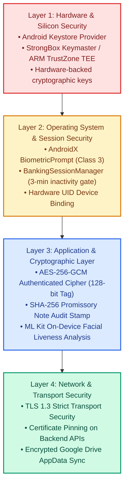
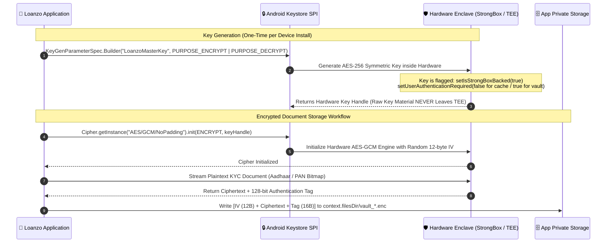
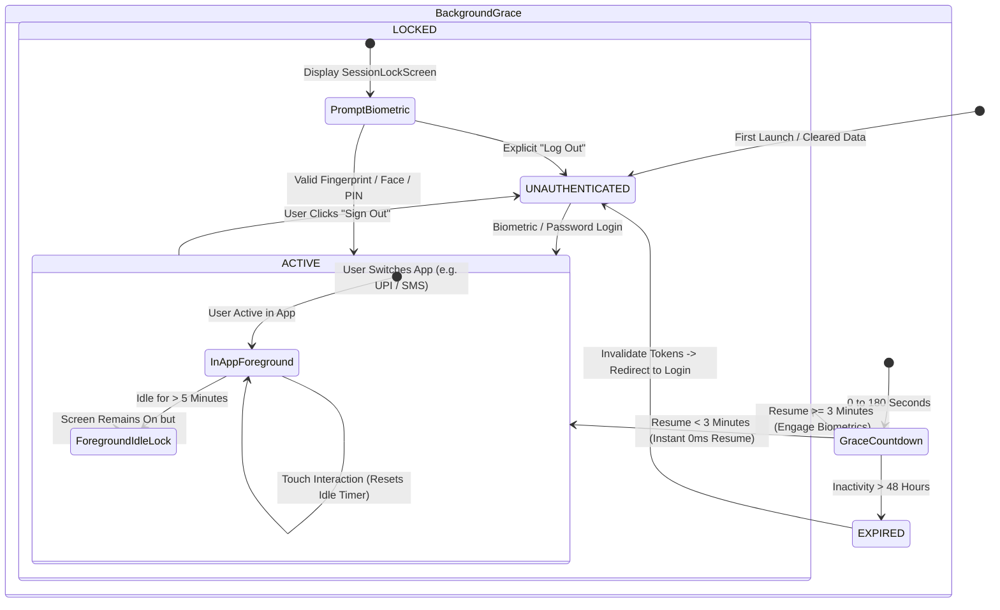
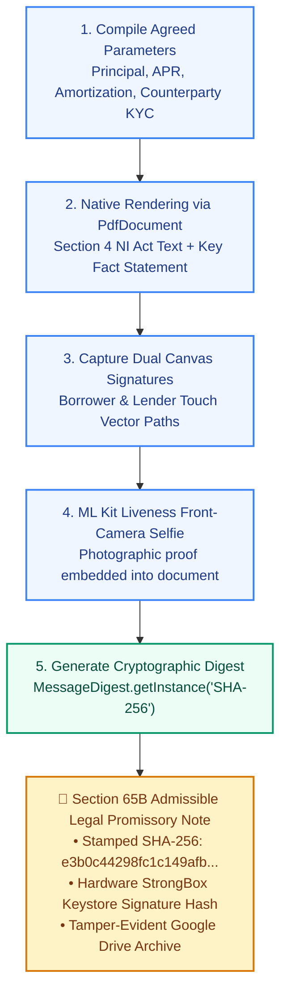

# 🔒 Loanzo Security Architecture, Cryptography & Threat Model

<div align="center">

### **Institutional Security Blueprint & Cryptographic Enforcement**
*Comprehensive technical specification of Hardware KeyStore protection, AES-256-GCM document encryption, Class 3 biometric session controls, and STRIDE threat modeling.*

---

[](https://csrc.nist.gov/publications/detail/sp/800-38d/final)
[](https://source.android.com/security/keystore)
[](https://developer.android.com/training/sign-in/biometric-auth)
[](https://www.meity.gov.in)

</div>

---

## 📑 Table of Contents
1. [Security Architecture Overview & Defense-in-Depth](#1-security-architecture-overview--defense-in-depth)
2. [Hardware-Backed Android KeyStore Architecture](#2-hardware-backed-android-keystore-architecture)
3. [Encrypted Document Vault Specification (AES-256-GCM)](#3-encrypted-document-vault-specification-aes-256-gcm)
4. [Biometric Session Lifecycle & Guard System](#4-biometric-session-lifecycle--guard-system)
5. [Contract Integrity, SHA-256 Hashes & Sec 65B Certification](#5-contract-integrity-sha-256-hashes--sec-65b-certification)
6. [STRIDE Threat Model & Vulnerability Mitigations](#6-stride-threat-model--vulnerability-mitigations)
7. [Digital Personal Data Protection Act (DPDPA 2023) Compliance](#7-digital-personal-data-protection-act-dpdpa-2023-compliance)

---

## 1. Security Architecture Overview & Defense-in-Depth

Loanzo implements a multi-layered **Defense-in-Depth Security Model** engineered to protect retail capital, sensitive government identification documents, and legally enforceable promissory notes:



---

## 2. Hardware-Backed Android KeyStore Architecture

Master encryption keys never leave the secure hardware boundary of the physical device. Key generation and cryptographic operations occur within an isolated hardware security module (HSM):



### Key Hardware Flags & Security Invariants:
1. **StrongBox Backed**: When available on modern Android devices (e.g., Google Titan M, Samsung Knox Vault), key operations are offloaded to dedicated discrete tamper-resistant microcontrollers.
2. **Key Non-Exportability**: Keys generated within the Android Keystore cannot be extracted, exported, or viewed in memory by debugging tools or root exploits.
3. **Hardware Device Binding**: Device identifiers are composed of `Settings.Secure.ANDROID_ID` combined with the hardware build serial and CPU architecture signature to verify that credentials have not been cloned to unauthorized emulators.

---

## 3. Encrypted Document Vault Specification (AES-256-GCM)

All customer KYC documents (Aadhaar XML, PAN images, bank passbook photographs, and signed property deeds) are stored using **Galois/Counter Mode (AES-256-GCM)**, providing both **Confidentiality** and **Authenticity**.

### Binary File Structure of Stored Vault Documents (`.enc`):
```
 0                   1                   2                   3
 0 1 2 3 4 5 6 7 8 9 0 1 2 3 4 5 6 7 8 9 0 1 2 3 4 5 6 7 8 9 0 1
+-+-+-+-+-+-+-+-+-+-+-+-+-+-+-+-+-+-+-+-+-+-+-+-+-+-+-+-+-+-+-+-+
|                    Magic Header: "LZVAULT1"                   |
+-+-+-+-+-+-+-+-+-+-+-+-+-+-+-+-+-+-+-+-+-+-+-+-+-+-+-+-+-+-+-+-+
|                  Initialization Vector (IV)                   |
|                      (12 Bytes / 96 Bits)                     |
+-+-+-+-+-+-+-+-+-+-+-+-+-+-+-+-+-+-+-+-+-+-+-+-+-+-+-+-+-+-+-+-+
|                                                               |
|                   AES-256 Encrypted Payload                   |
|                     (Variable Length: N Bytes)                |
|                                                               |
+-+-+-+-+-+-+-+-+-+-+-+-+-+-+-+-+-+-+-+-+-+-+-+-+-+-+-+-+-+-+-+-+
|                    GCM Authentication Tag                     |
|                     (16 Bytes / 128 Bits)                     |
+-+-+-+-+-+-+-+-+-+-+-+-+-+-+-+-+-+-+-+-+-+-+-+-+-+-+-+-+-+-+-+-+
```

### Cryptographic Properties:
- **Cipher**: `AES/GCM/NoPadding`
- **Key Length**: 256 bits (32 bytes)
- **IV Generation**: `SecureRandom.getInstanceStrong()` producing a unique 12-byte IV for every individual document write (guaranteeing zero IV-reuse vulnerabilities).
- **Authentication Tag Length**: 128 bits (16 bytes). If even a single byte of the encrypted file is tampered with on disk, decryption fails immediately with `AEADBadTagException`.

---

## 4. Biometric Session Lifecycle & Guard System

In `BankingSessionManager.kt`, session states are governed by a banking-grade state machine ensuring seamless multitasking without compromising device-level security.



### Timing Thresholds:
| Configuration Parameter | Value | Purpose |
| :--- | :--- | :--- |
| `INACTIVITY_LOCK_TIMEOUT_MS` | 180,000 ms (3 min) | Seamless grace window allowing users to verify SMS OTPs or check bank apps without re-authenticating. |
| `FOREGROUND_IDLE_TIMEOUT_MS` | 300,000 ms (5 min) | Protects against shoulder surfing or unattended unlocked devices with the screen active. |
| `HARD_EXPIRY_TIMEOUT_MS` | 172,800,000 ms (48 hours) | Hard token revocation forcing complete re-authentication after prolonged absence. |

---

## 5. Contract Integrity, SHA-256 Hashes & Sec 65B Certification

When a borrower and lender execute a loan, the contract generation engine (`AgreementGenerator.kt` & `LegalDossierExportEngine.kt`) creates an immutable, legally binding document compliant with Indian evidentiary law:



### Section 65B Indian Evidence Act Admissibility:
Per the Supreme Court of India's ruling in *Arjun Panditrao Khotkar v. Kailash Kushanrao Gorantyal (2020)*, electronic records produced by computer systems are admissible in court when accompanied by a statutory certificate stating:
1. The electronic device was operating properly and under lawful control throughout the relevant period.
2. The hash of the digital agreement was computed at the exact time of signing using standard cryptographic algorithms (SHA-256).
3. The underlying cryptographic record has not been altered, modified, or tampered with.

Loanzo's `LegalDossierExportEngine.kt` automatically compiles this statutory Section 65B Certificate into the final legal dossier.

---

## 6. STRIDE Threat Model & Vulnerability Mitigations

| Threat Category | Attack Vector Description | Severity | Loanzo Architectural Defense & Countermeasure |
| :--- | :--- | :---: | :--- |
| **Spoofing Identity** | Attacker registers with someone else's Aadhaar or PAN photo. | **Critical** | Mandatory DigiLocker OAuth retrieval + on-device ML Kit blink/smile liveness selfie verification. |
| **Tampering with Data** | Malicious user alters SQLite balance or loan APR on a rooted phone. | **High** | Dual-party signed SHA-256 agreement hash checked against remote Firestore audit records upon sync. |
| **Repudiation** | Borrower denies ever receiving funds or signing the promissory note. | **High** | Embedded selfie liveness photo, canvas biometric vector coordinates, and bank UTR payment reference. |
| **Information Disclosure** | Unauthorized third party views sensitive KYC documents on disk. | **Critical** | Local documents are encrypted with AES-256-GCM via Android Keystore; raw plaintext is never written to public storage. |
| **Denial of Service** | Flooding backend AI endpoints to exhaust rate limits or quotas. | **Medium** | 3-way Multi-AI Race Engine with automatic timeout failover to local deterministic heuristic provider. |
| **Elevation of Privilege** | Normal consumer attempts to access Field Agent or Admin consoles. | **Critical** | Explicit role-based routing gates (`Routes.AGENT_MAIN` and `@satyam0810` chat ID verification in webhook). |

---

## 7. Digital Personal Data Protection Act (DPDPA 2023) Compliance

Under the **Digital Personal Data Protection Act (DPDPA), 2023**, Loanzo adheres to strict privacy and data governance principles:

1. **Data Minimization (Section 6)**: The application only captures personal data strictly required to execute the financial contract (Aadhaar name, masked PAN, contact phone, bank details). Contact lists, location logs, and unrelated media are never harvested.
2. **Purpose Limitation (Section 5)**: Financial and KYC data is utilized solely for credit underwriting, contract execution, and regulatory compliance. It is never commercialized, packaged, or shared with third-party advertising brokers.
3. **Right to Erasure & Grievance Redressal (Section 12 & 13)**: Users have the right to request deletion of their profile upon full settlement of all active debt obligations. Grievance redressal is directly integrated via the in-app **Smart Mediation Desk**.
4. **Zero Third-Party Telemetry**: Loanzo contains zero commercial tracking SDKs (no Facebook Pixel, AppsFlyer, or third-party ad networks).

---

<div align="center">
<b>Loanzo Security & Cryptographic Engineering</b> • Enterprise Threat Model Specification
</div>
