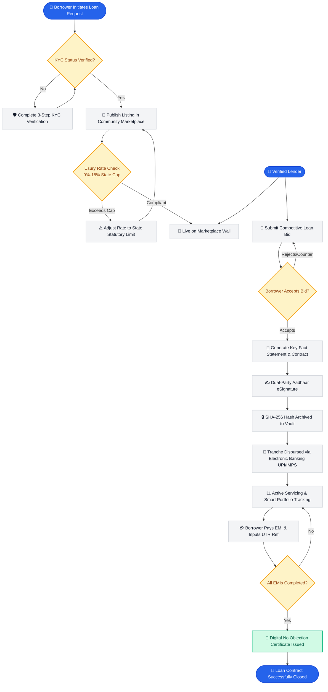
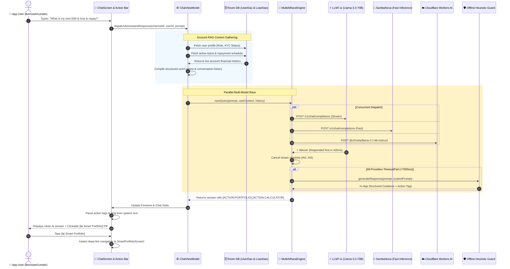
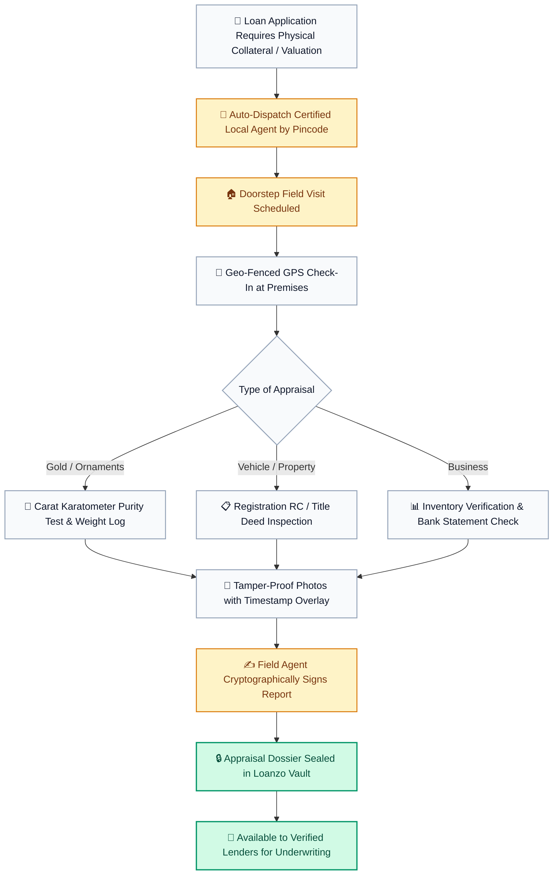
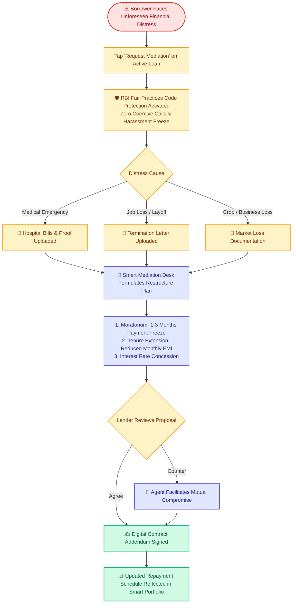

# 🏛️ Loanzo System Architecture & Core Flowcharts

> Comprehensive technical blueprints, operational lifecycle flowcharts, and multi-model AI architecture documentation for **Loanzo** — India's premier P2P social lending and micro-credit community platform.

---

## 📑 Table of Contents
1. [End-to-End P2P Lending Lifecycle](#1-end-to-end-p2p-lending-lifecycle)
2. [AI Copilot & Multi-AI Race Engine Architecture](#2-ai-copilot--multi-ai-race-engine-architecture)
3. [Identity & 3-Step KYC Verification Flow](#3-identity--3-step-kyc-verification-flow)
4. [Certified Agent Field Inspection & Collateral Assaying](#4-certified-agent-field-inspection--collateral-assaying)
5. [Smart Mediation Desk & RBI Hardship Restructuring](#5-smart-mediation-desk--rbi-hardship-restructuring)
6. [Statutory Compliance & Legal Security Matrix](#6-statutory-compliance--legal-security-matrix)

---

## 1. End-to-End P2P Lending Lifecycle

---

## 2. AI Copilot & Multi-AI Race Engine Architecture

---

## 3. Identity & 3-Step KYC Verification Flow

```mermaid
graph LR
    classDef step fill:#EFF6FF,stroke:#3B82F6,stroke-width:1.5px,color:#1E3A8A;
    classDef success fill:#ECFDF5,stroke:#10B981,stroke-width:2px,color:#065F46;

    subgraph Step 1: PAN Validation
        A1[💳 Enter PAN Card Number]:::step --> A2[Verify via Income Tax Route]:::step
        A2 --> A3[Validate Legal Name & DOB Match]:::step
    end

    subgraph Step 2: Aadhaar XML
        B1[🆔 UIDAI DigiLocker / Aadhaar OTP]:::step --> B2[Download Signed eKYC XML]:::step
        B2 --> B3[Verify Digital Signature & Address]:::step
    end

    subgraph Step 3: Facial Liveness
        C1[🤳 Real-Time Camera Scan]:::step --> C2[Blink & Micro-Movement Detection]:::step
        C2 --> C3[Penny-Drop Bank Verification]:::step
    end

    A3 --> B1
    B3 --> C1
    C3 --> Approved[🛡️ Full KYC Completed & Badge Assigned]:::success
```

---

## 4. Certified Agent Field Inspection & Collateral Assaying

---

## 5. Smart Mediation Desk & RBI Hardship Restructuring

---

## 6. Statutory Compliance & Legal Security Matrix

| Regulatory Requirement | Governing Statute / Rule | Loanzo Technical Implementation |
| :--- | :--- | :--- |
| **P2P Interest Rate Caps** | State Money Lenders Acts (e.g., Maharashtra 9%-12%, Karnataka 14%-18%) | `RuleEngine.kt` auto-caps loan listings and bids. Listings exceeding caps are rejected. |
| **Cash Transaction Ceiling** | Income Tax Act, 1961 (Sections 269SS & 269T) | Loans & repayments ≥ ₹20,000 strictly enforced via electronic banking routes (UPI/NEFT/RTGS). |
| **Digital Contract Enforceability** | Indian Contract Act, 1872 & Information Technology Act, 2000 (Sec 10A) | Digital loan agreements backed by Aadhaar OTP eSignatures and tamper-evident SHA-256 audit trails. |
| **Key Fact Statement (KFS)** | RBI Digital Lending Regulatory Framework (2022 Guidelines) | Automated instant KFS sheet summarizing all-inclusive APR, EMI schedule, and penal charges upfront. |
| **Fair Recovery Practices** | RBI Fair Practices Code for NBFCs & Digital Lenders | In-app Smart Mediation Desk for distress restructuring. Strict prohibition of third-party intimidation. |
| **Data Privacy & Vault Security** | Digital Personal Data Protection Act, 2023 (DPDPA) | End-to-end encrypted Document Vault; biometric templates and PAN/Aadhaar never shared with counterparties. |
